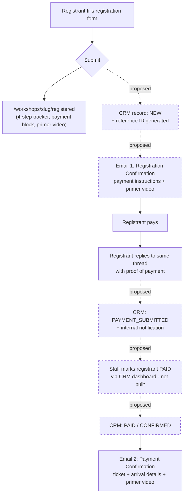

# Coach Adrian Ding — Demo Site

A multi-page Next.js site built to pitch Coach Adrian Ding on a rebuild of
adrianding.com. **Frontend-only** — every form, login, and content list is UI without a
backend. No CMS, no CRM, no auth, no email sending, no payments; Phase 2 builds all of
that. `PRD.md` is the scope/copy source of truth; `MEETING-NOTES.md` has the client
decisions behind it.

This README is the handoff document for both audiences: the PM (scope, status, open
decisions) and the dev team (architecture, gotchas, setup) building Phase 2.

> **Fonts — resolved (2026-09-29).** The site uses free, open-licensed fonts only: **Prata**
> (SIL OFL) for the serif, **Red Hat Display** (SIL OFL) for body, **Geist Mono** (SIL OFL)
> for mono/code contexts. The Seasons and Abramo (paid commercial faces) are dropped — no
> license to carry, no swap needed before handoff. The earlier paid-font copies still exist
> in git history; the repo is private, so that's not a distribution concern. See
> [Decisions pending](#decisions-pending-client--chan).

## Table of contents

- [Status at a glance](#status-at-a-glance)
- [Phase 2 map](#phase-2-map)
- [Form flows, emails & CRM triggers](#form-flows-emails--crm-triggers)
- [Decisions pending (client / Chan)](#decisions-pending-client--chan)
- [Open questions for the team](#open-questions-for-the-team)
- [Temporary review tools](#temporary-review-tools)
- [Known issues / tech debt](#known-issues--tech-debt)
- [Developer guide](#developer-guide)
  - [Setup](#setup)
  - [Environment variables](#environment-variables)
  - [Other scripts](#other-scripts)
  - [Stack](#stack)
  - [Project structure](#project-structure)
  - [Routes](#routes)
  - [Where content lives](#where-content-lives)
  - [Design system](#design-system)
  - [Animation architecture (GSAP)](#animation-architecture-gsap)
  - [Gotchas](#gotchas)
  - [Images](#images)
  - [Share images (Open Graph cards)](#share-images-open-graph-cards)
  - [Quality gates](#quality-gates)
  - [Deploy](#deploy)
- [Next steps](#next-steps)

---

## Status at a glance

| Route                                  | Status        | Real vs. mocked                                                                                                                                                                               |
| -------------------------------------- | ------------- | --------------------------------------------------------------------------------------------------------------------------------------------------------------------------------------------- |
| `/`                                    | Built         | Real copy/layout; stats, testimonials, some company logos are placeholder (see [Phase 2 map](#phase-2-map))                                                                                   |
| `/about`                               | Built         | Real copy/layout; timeline milestones and industry-count stat pending client confirm                                                                                                          |
| `/workshops`                           | Built         | Real UI (filter, calendar); catalogue is static mock data                                                                                                                                     |
| `/workshops/[slug]`                    | Built         | Real UI incl. registration form, FAQ, sticky register bar; prices, curriculum framing, testimonials are placeholders pending sign-off. Has its own `opengraph-image.tsx`                      |
| `/workshops/[slug]/registered`         | Built         | Confirmation UI only — form doesn't submit; payment details (bank/GCash) are placeholders. `noindex`                                                                                          |
| `/corporate-training`                  | Built         | Real UI incl. programme carousel (10 programmes, 4 are placeholders to judge a longer list) and inquiry form                                                                                  |
| `/corporate-training/inquiry-received` | Built         | Confirmation UI only — form doesn't submit. `noindex`                                                                                                                                         |
| `/gallery` + `/gallery/[slug]`         | Built         | Real UI; events, photos, and Adrian's "reflections" copy are all representative placeholders. Client asked to defer further gallery work to a later phase — page stays live in the demo as-is |
| `/staff-login`                         | UI shell only | "Sign in with Google" button is inert, no auth provider                                                                                                                                       |
| `/email-templates`                     | UI shell only | Static preview of 3 email templates (copy + layout), no send wiring, `noindex`                                                                                                                |

`npm run validate` (typecheck + lint + format check) is the pre-delivery gate — see
[Quality gates](#quality-gates).

---

## Phase 2 map

| Feature                                        | Current mock (file)                                                                                                        | Phase 2 system                                                 | Notes & traps                                                                                                                                                                                                                                                                                                                                                                                                                                                                                                                                                                                                                                                                                                                                                                                                                                                                                                                                                                                                                                                                                                                                                                                                                                                |
| ---------------------------------------------- | -------------------------------------------------------------------------------------------------------------------------- | -------------------------------------------------------------- | ------------------------------------------------------------------------------------------------------------------------------------------------------------------------------------------------------------------------------------------------------------------------------------------------------------------------------------------------------------------------------------------------------------------------------------------------------------------------------------------------------------------------------------------------------------------------------------------------------------------------------------------------------------------------------------------------------------------------------------------------------------------------------------------------------------------------------------------------------------------------------------------------------------------------------------------------------------------------------------------------------------------------------------------------------------------------------------------------------------------------------------------------------------------------------------------------------------------------------------------------------------ |
| Workshops catalogue                            | `src/lib/workshops.ts` (static array, incl. `NEXT_WORKSHOP` derived export, `WORKSHOP_TAGS` taxonomy)                      | CMS                                                            | Field shape (`problem`, `outcomes`, `whatToExpect`, `primerBlurb`, `seatsLeft`, `tags`) is the contract to replicate. `tags` becomes a fixed multi-select taxonomy (1–3/course), not free text — the `/workshops` filter chips derive from it.                                                                                                                                                                                                                                                                                                                                                                                                                                                                                                                                                                                                                                                                                                                                                                                                                                                                                                                                                                                                               |
| Workshop registration form                     | `workshops/[slug]/_sections/registration-form.tsx`                                                                         | CRM (lead capture)                                             | React Hook Form + Zod, client-side only. Must: (1) create CRM record with status `NEW` first, (2) then email owners. Record write failing must block the visitor from reaching the confirmation page; email failing must not (retry the email, keep the record). Full contract in `PRD.md` → "Phase 2 handoff — lead capture". Full step-by-step flow incl. payment/CRM/email: [Form flows, emails & CRM triggers](#form-flows-emails--crm-triggers).                                                                                                                                                                                                                                                                                                                                                                                                                                                                                                                                                                                                                                                                                                                                                                                                        |
| Corporate inquiry form                         | `corporate-training/_sections/inquiry-form.tsx`                                                                            | CRM (lead capture)                                             | Same contract as above. Captures primary programme + "Also interested in" multi-select (`?program=<key>#inquiry` prefill). Full flow: [Form flows, emails & CRM triggers](#form-flows-emails--crm-triggers).                                                                                                                                                                                                                                                                                                                                                                                                                                                                                                                                                                                                                                                                                                                                                                                                                                                                                                                                                                                                                                                 |
| Staff login                                    | `src/app/staff-login/page.tsx`                                                                                             | Auth (Google, staff-only)                                      | No provider, no session, no protected routes yet. Confirm with Adrian what staff actually need to do here before building real auth — the "why" isn't settled, only the login screen is. Its intended role in marking registrants PAID is covered in [Form flows, emails & CRM triggers](#form-flows-emails--crm-triggers).                                                                                                                                                                                                                                                                                                                                                                                                                                                                                                                                                                                                                                                                                                                                                                                                                                                                                                                                  |
| Email templates page                           | `src/app/email-templates/_sections/templates.tsx`                                                                          | Resend (or equivalent) transactional email                     | 3 templates previewed: workshop registration confirmation, payment confirmation (triggered by staff marking a registrant PAID in the CRM), corporate inquiry acknowledgment. This page is copy/layout only — no send-trigger wiring. It is separate from the owner "new inquiry" notification email required by the lead-capture contract above. Full email catalogue incl. proposed internal/reminder emails: [Form flows, emails & CRM triggers](#form-flows-emails--crm-triggers).                                                                                                                                                                                                                                                                                                                                                                                                                                                                                                                                                                                                                                                                                                                                                                        |
| Testimonials                                   | `src/lib/testimonials.ts`                                                                                                  | CMS content, sourced from `Coach_Adrian_Ding_Website_2025.pdf` | Every quote is a placeholder; no headshots supplied. Don't paraphrase when swapping in real ones — use them verbatim.                                                                                                                                                                                                                                                                                                                                                                                                                                                                                                                                                                                                                                                                                                                                                                                                                                                                                                                                                                                                                                                                                                                                        |
| Gallery                                        | `src/lib/gallery.ts`                                                                                                       | CMS                                                            | Static array is the schema to match, incl. `relatedWorkshop` relation. All events/photos/reflections copy are representative stand-ins. Deferred by the client — not a blocker, just not final content.                                                                                                                                                                                                                                                                                                                                                                                                                                                                                                                                                                                                                                                                                                                                                                                                                                                                                                                                                                                                                                                      |
| Companies logos                                | `src/lib/companies.ts`                                                                                                     | CMS or static asset list                                       | 44/91 roster companies have logo artwork (`co-*` files in `public/images/logos/`); the other 47 render as name chips by design, so gaps stay visible. Priority categories with zero artwork: Finance, Real Estate, Hotels, Food & Retail, SMEs.                                                                                                                                                                                                                                                                                                                                                                                                                                                                                                                                                                                                                                                                                                                                                                                                                                                                                                                                                                                                              |
| Timeline                                       | `src/lib/timeline.ts`                                                                                                      | CMS                                                            | Founding year and milestone wording need client confirmation.                                                                                                                                                                                                                                                                                                                                                                                                                                                                                                                                                                                                                                                                                                                                                                                                                                                                                                                                                                                                                                                                                                                                                                                                |
| Specializations                                | `src/lib/specializations.ts`                                                                                               | CMS                                                            | Programme copy and `usefulFor` bullets need Adrian's sign-off; several photos are `placeholderImg()` Unsplash stand-ins pending real photography.                                                                                                                                                                                                                                                                                                                                                                                                                                                                                                                                                                                                                                                                                                                                                                                                                                                                                                                                                                                                                                                                                                            |
| Social cards (per-course + site-wide OG image) | `src/app/workshops/[slug]/opengraph-image.tsx`, `src/app/opengraph-image.tsx`, `src/lib/{og-photo,og-fonts,og-card}.ts(x)` | Derived from CMS record — **not a CMS field**                  | Per-course cards are generated at build time from the `Workshop` record (`image`, `title`, `schedule`, `venue`, `city`) — never add an "upload OG image" field, it would drift the moment a date changes. Per-course design (layout "L1" + wordmark "E6 soft glow") was approved by Chan on 2026-09-28; the site-wide card (every other page, design "F2") was approved 2026-09-29 — either changes go through him, not a unilateral dev tweak. Fonts still need TTF (`.woff2` fails to decode); photos no longer have a format trap — `og-photo.ts` runs any format `sharp` reads (incl. `.webp`) through crop/duotone and hands Satori an inlined JPEG data URI, so the old "source must be JPEG/PNG" constraint is gone. See [Share images (Open Graph cards)](#share-images-open-graph-cards) for the full implementation guide and [Gotchas](#gotchas) for the remaining Satori traps. A CMS edit must trigger a rebuild/revalidation of that course's route or the card goes stale. `params` is a `Promise` in metadata routes — typing it as a plain object compiles but silently renders the same fallback card for every slug (this shipped broken once already). Full contract: `PRD.md` → "Phase 2 handoff — the social cards belong in the CMS". |
| Analytics / SEO metadata                       | `src/app/layout.tsx` (`metadataBase`, OG/Twitter tags)                                                                     | Analytics provider (GA4/Plausible/etc. — TBD)                  | `NEXT_PUBLIC_SITE_URL` must be set to the real serving host before delivery — see [Environment variables](#environment-variables). No analytics package is installed yet.                                                                                                                                                                                                                                                                                                                                                                                                                                                                                                                                                                                                                                                                                                                                                                                                                                                                                                                                                                                                                                                                                    |

The `src/lib/*.ts` files above are the seams Phase 2 replaces with real CMS data — treat
each one's shape as the data contract a CMS schema should match.

---

## Form flows, emails & CRM triggers

End-to-end flow for both forms — screens, primer video placement, CRM status transitions,
and which email fires when. Chan's description of the intended **workshop** flow is the
source of truth for section A; the **corporate** flow (section D) was never specified by
him, so it is documented as-built plus a proposed Phase 2 flow, clearly marked. Every "In
the demo today" line is checked against the actual file — nothing here is assumed built
unless a path is cited.

### A. Workshop registration flow

1. **Registrant lands on a workshop page and fills the form.**
   Multi-step (who's registering → about you → confirm + consent), React Hook Form + Zod.
   **In the demo today:** built, client-side only — `src/app/workshops/[slug]/_sections/registration-form.tsx`.

2. **Registrant submits.**
   System should: (a) create a CRM record at status `NEW`, generate a reference ID, (b)
   then email the registrant a confirmation with payment instructions, (c) route the
   registrant to the "form-submitted" page.
   **In the demo today:** submit only writes `{kind:"workshop", slug, fullName, email,
phone}` to `sessionStorage` (`saveHandoff()` in `src/app/_lib/handoff.ts`) and does a
   client-side `router.push` to `/workshops/[slug]/registered`
   (`registration-form.tsx` `onSubmit`, L131–141). **No CRM write, no email, no reference
   ID is generated anywhere in the codebase.**

3. **Registrant lands on the form-submitted page** (`/workshops/[slug]/registered`).
   Shows a 4-step tracker (Registered ✓ → You send payment → We confirm it → Primer
   email), a personalised greeting (first name read back from the handoff), the payment
   block, the primer video, and a "what the day looks like" summary.
   **In the demo today:** fully built —
   `src/app/workshops/[slug]/registered/page.tsx` composes
   `_sections/{confirmed,payment,primer,expect}.tsx`. Personalisation degrades cleanly to
   generic copy on a direct visit (no handoff in this tab) or if `sessionStorage` throws
   (private-mode Safari etc.) — every consumer is written to handle a `null` read.
   - **Primer video (placement 1):** `_sections/primer.tsx` renders `PrimerPlayer` with
     `workshop.primerBlurb` — a placeholder player, no real video asset. **Which video,
     and is it the same one used in the payment-instructions email below: TBD with
     Adrian** (see Open questions).
   - **"Reference" shown here:** the payment block's Reference row reads "Your full name +
     `{workshop.title}`" (`_sections/payment.tsx` L87–90) — a payment memo instruction,
     **not** a system-generated ID. No registration/reference ID (e.g. `AD-<COURSE>-<NNNN>`,
     proposed) exists anywhere in the demo. Without one, every confirmation email for the
     same workshop currently shares an identical subject line (see the email catalogue
     below), so nothing lets staff match a reply back to a specific registrant except the
     sender's name/email.
   - **48-hour seat hold:** stated as fact in the copy but flagged `TODO: client sign-off`
     in the file itself — proposed policy, not confirmed (also tracked in
     [Decisions pending](#decisions-pending-client--chan) item 6).
   - Bank transfer details and the GCash QR are placeholder styling — no real payment
     details exist yet.

4. **Confirmation email fires** with payment instructions and (per Chan) a primer video —
   "possibly the same primer video or another primer video."
   **In the demo today:** static copy preview only, at `/email-templates` → template
   **"1 · Workshop Registration Confirmation"** (`src/app/email-templates/_sections/templates.tsx`
   `TEMPLATES[0]`). Trigger text in the file: "Sent immediately after the workshop
   registration form is submitted." Contains payment instructions, the reply-with-proof
   instruction, and a video placeholder block. **Not wired to any send trigger** — Resend
   (or equivalent) integration is Phase 2.

5. **Registrant pays, then replies to the same email thread with proof of payment**
   (photo/screenshot), per the confirmation email's instruction and the payment block's
   copy ("Reply to your confirmation email with a photo or screenshot of the payment").
   **Proposed Phase 2 mechanism** (not built, not specified by Chan beyond "same email
   thread"): Resend inbound-email parsing routed by the reference ID in the subject line,
   or a shared staff inbox staff scan manually and match to the CRM record by reference
   ID / registrant name+email. Either way, **the reference ID must exist and be in every
   email subject** for this to be reliable — see step 2/3 above.

6. **Staff marks the registrant PAID in the CRM.**
   Chan: "someone on the client side should mark that user as paid." This is a manual
   staff action against a CRM record, done from wherever `/staff-login` leads.
   **In the demo today:** `/staff-login` is a static UI shell — the "Sign in with Google"
   button is inert (`src/app/staff-login/page.tsx`), there is no auth provider, no
   session, and **no dashboard/CRM view exists anywhere in the demo** to actually list
   registrations or mark one paid. The page's own copy describes the intended purpose
   ("managing registrations, marking workshops as paid") but nothing behind it is built.

7. **Payment-confirmed email fires**, confirming the registrant is accepted / has a ticket.
   **In the demo today:** static copy preview at `/email-templates` → template
   **"2 · Payment Confirmation"** (`TEMPLATES[1]`). Trigger text: "Sent when staff mark
   the registrant as PAID in the CRM" — matches Chan's description. Contains arrival
   instructions, a primer video slot (again TBD whether same/different video), and a
   throwaway mention of a day-before reminder ("We'll also send a reminder the day
   before") that is **not** itself a template — see the email catalogue's suggested
   reminders. **Ticket:** no ticket, QR, or code concept exists in the template today.
   Proposal: the ticket _is_ the reference ID, optionally rendered as a QR encoding it —
   confirm with Chan/Adrian before building.

### B. CRM status model — registrations (proposed)

The site's only defined status today is `NEW` (README → "Phase 2 handoff — lead
capture"). The rest is proposed, built to fit Chan's described flow — confirm the exact
names before implementation.

| Status                           | Trigger                                                                         | Who / what                                        | Email fired                                                    | Built today?                                                                         |
| -------------------------------- | ------------------------------------------------------------------------------- | ------------------------------------------------- | -------------------------------------------------------------- | ------------------------------------------------------------------------------------ |
| `NEW`                            | Registration form submitted                                                     | System (on submit)                                | Template 1 — Registration Confirmation                         | **Not built.** `NEW` exists only in README/PRD text, never written by any code path. |
| `AWAITING_PAYMENT` _(proposed)_  | Same moment as `NEW` — may just be `NEW`'s meaning rather than a separate state | System                                            | —                                                              | Not built                                                                            |
| `PAYMENT_SUBMITTED` _(proposed)_ | Registrant replies to the email thread with proof of payment                    | System (inbound parse) or staff logging the reply | Internal "proof of payment received" notification _(proposed)_ | Not built                                                                            |
| `PAID` / `CONFIRMED`             | Staff manually marks the registrant paid                                        | Staff, via the (unbuilt) CRM dashboard            | Template 2 — Payment Confirmation                              | **Not built** — no dashboard exists to perform this action                           |
| `EXPIRED` _(proposed)_           | Hold window (48h, unconfirmed) elapses with no payment                          | System                                            | Suggested payment-reminder email _(proposed, not built)_       | Not built                                                                            |
| `CANCELLED` _(proposed)_         | Staff or registrant cancels                                                     | Staff                                             | —                                                              | Not built                                                                            |

### C. Email catalogue

| Email                                             | Trigger                                                     | Recipient              | Contents                                                                                            | Reply behaviour                                            | Template on `/email-templates` today?                                                                                                                                |
| ------------------------------------------------- | ----------------------------------------------------------- | ---------------------- | --------------------------------------------------------------------------------------------------- | ---------------------------------------------------------- | -------------------------------------------------------------------------------------------------------------------------------------------------------------------- |
| 1 · Workshop Registration Confirmation            | Registration form submitted                                 | Registrant             | Event summary, payment instructions, reply-with-proof instruction, primer video slot                | Registrant replies with proof of payment — **same thread** | Yes — `TEMPLATES[0]`, `templates.tsx`                                                                                                                                |
| 2 · Payment Confirmation                          | Staff marks registrant `PAID` in CRM                        | Registrant             | Payment confirmed, arrival/what-to-bring, primer video slot, mentions a reminder "day before"       | —                                                          | Yes — `TEMPLATES[1]`                                                                                                                                                 |
| 3 · Corporate Inquiry Acknowledgment              | Corporate inquiry form submitted                            | Inquirer               | Ack of receipt, 2-business-day turnaround, inquiry playback, credibility blurb                      | Inquirer replies to correct any submitted detail           | Yes — `TEMPLATES[2]`                                                                                                                                                 |
| Internal — new registration _(proposed)_          | Registration form submitted                                 | Adrian's team          | Lead summary, link to the CRM record                                                                | —                                                          | No — the lead-capture contract requires "email the owners" but this is a separate surface from the 3 visitor templates above (README already flags this distinction) |
| Internal — proof of payment received _(proposed)_ | Registrant reply to the confirmation thread is detected     | Adrian's team          | Flags the thread for staff review, links the CRM record                                             | —                                                          | No                                                                                                                                                                   |
| Payment reminder _(proposed)_                     | Some time before the hold window (48h, unconfirmed) expires | Registrant             | Restates payment instructions + reference, urgency                                                  | Same thread                                                | No                                                                                                                                                                   |
| Event reminder _(proposed)_                       | Day before the workshop                                     | Registrant (PAID only) | Logistics recap — the "day before" reminder Template 2's copy alludes to but doesn't itself send it | —                                                          | No                                                                                                                                                                   |

### D. Corporate training inquiry flow

Chan did not describe this flow — what follows is what the demo builds today, plus a
**proposed** Phase 2 flow. Everything past step 2 is a proposal; confirm with Chan/Adrian.

1. **Inquirer fills the 4-step inquiry form** (details → company → programme/headcount/
   date/venue → confirm+consent), optionally prefilled via `?program=<key>#inquiry` from
   the programme carousel. **In the demo today:** built —
   `src/app/corporate-training/_sections/inquiry-form.tsx`.
2. **On submit:** writes `{kind:"corporate", fullName, email, company, program,
attendees, targetDate, venue, alsoInterested}` to `sessionStorage` and routes to
   `/corporate-training/inquiry-received`. **No CRM write, no email** — same gap as the
   workshop form.
3. **Lands on `/corporate-training/inquiry-received`:** a 3-step "what happens next"
   explainer (review → discovery call → proposal), a brand-ground "you'll hear back
   within 2 business days" commitment block (`TODO: client sign-off`), a submitted-data
   playback, a primer video ("How a Maximum Impact programme is built" — a _different_
   video from the workshop primer, not yet produced), and credibility stats/logos.
   **In the demo today:** fully built, same personalise-or-fall-back-to-generic pattern
   as the workshop page.
4. **Acknowledgment email fires** — Template 3, static preview only, not wired.
5. _(Proposed, not built)_ **Internal notification** to Adrian's team of the new inquiry.
6. _(Proposed, not built)_ **CRM lead pipeline for corporate inquiries** — a sales
   pipeline is a different shape from the registration pipeline above:

   | Status _(all proposed)_ | Meaning                                                                 |
   | ----------------------- | ----------------------------------------------------------------------- |
   | `NEW`                   | Inquiry submitted (the one status the site's contract actually defines) |
   | `CONTACTED`             | Discovery call scheduled/held                                           |
   | `PROPOSAL_SENT`         | Written programme + investment sent                                     |
   | `WON` / `LOST`          | Deal outcome                                                            |

   Whether a primer video belongs at the acknowledgment-email stage too (mirroring the
   workshop email) is also open — undecided, propose confirming with Chan/Adrian.

### E. Workshop flow diagram



Dashed nodes are proposed/not built; solid nodes exist in the demo today.

---

## Decisions pending (client / Chan)

Pulled from `MEETING-NOTES.md` (2026-09-20 meeting) — items not yet marked resolved:

1. **Pricing.** Every course price shown (₱6,500 / ₱18,500) is invented, asterisked as
   "indicative." Need his real numbers; if he wants early-bird/group pricing that's a
   structure change to flag now, not a number swap later.
2. **Copy sign-off.** The "equip further top producers" line (kept verbatim from his own
   wording, reads like a typo), the shortened Train-the-Trainers title, the per-course
   "problem" opening lines (written by us, first thing cold ad traffic reads), and the
   headline stats (20+ years, 20,000+ trained, Top 500 companies, sourced from the PRD not a
   verified source).
3. **Assets.** 47/91 company logos still missing (priority: Finance, Real Estate, Hotels,
   Food & Retail, SMEs); Genos/trainer-cert accreditation marks silhouette as unusable white
   blobs and need real vector logos (noted as a paid follow-on, not a blocker); primer/teaser
   videos are placeholder slots on every course page — worth asking Adrian directly if he has
   any event footage.
4. **Ad → course-page flow.** Confirm each ad links to its own course URL (not the homepage)
   — each course now has its own social preview card, so this is now safe to do.
5. **Corporate off-ramp placement.** "Train your team" sits after the register CTA on each
   course page (deliberate, so it doesn't cannibalize the seat). Confirm he's happy with the
   order.
6. **Registration/payment policy details.** The 48-hour seat hold window, the transfer
   window, and whether an official receipt is issued by default (`src/lib/workshop-faq.ts`,
   `registered/_sections/payment.tsx`) are proposed policy, not confirmed.
7. **Content confirmations.** Timeline founding year/milestones, AET/CPD accrediting-body
   names and years, industry-count stat, testimonials (pending
   `Coach_Adrian_Ding_Website_2025.pdf`), and the 4 placeholder corporate programmes added
   2026-09-24 (Sales Leadership & Coaching, Customer Service Excellence, Change Management &
   Resilience, Emotional Intelligence at Work) — confirm or delete each.

**Already resolved:** the About-prompt presentation (inline vs. slide-in card vs. pop-up) —
Adrian chose inline on 2026-09-19; the other two variants and the switcher were deleted, and
only `AboutPromptAnchor` (`src/app/_components/about-prompt.tsx`) remains in the codebase.
It is **not** a review tool — it's the permanent "Know more about Coach Adrian" link on the
workshop-detail and corporate-training pages.

### Open questions for the team

Genuinely unscoped decisions Phase 2 needs before implementation starts. Grouped by area,
specific to this codebase — not a generic backend checklist.

**CMS**

- Which CMS? The data contract to match is already written: `src/lib/workshops.ts`,
  `gallery.ts`, `companies.ts`, `testimonials.ts`, `timeline.ts`, `specializations.ts`,
  `certifications.ts` — each is the shape a schema should replicate, including relations like
  `GalleryEvent.relatedWorkshop`.
- Who edits it — just Adrian, or does staff (via `/staff-login`) get a role too? The staff
  login screen currently has no defined purpose beyond "CRM/CMS access" — what do staff
  actually do there day to day?
- How does a CMS publish/edit trigger the OG-image rebuild described in
  [Phase 2 map](#phase-2-map)? (Vercel on-demand revalidation, a webhook, a full rebuild —
  the team needs to pick one before the "regenerate on republish" requirement is real.)

**CRM**

- Where does lead data live — a CMS-adjacent table, a dedicated CRM (HubSpot/Pipedrive/
  custom), a spreadsheet? The contract (record-first, `NEW` status, then email) is written
  but the destination isn't chosen.
- What's the full lifecycle after `NEW`? The site only ever sets that one status; who defines
  and owns the rest (contacted, paid, attended, etc.)?
- The 4-step tracker on `/workshops/[slug]/registered` (registered → payment sent → staff
  confirms → primer email) represents a manual process today (a human marks a row paid).
  Does Phase 2 automate step 3, or stay manual with just the CRM digitized?
- Reference/registration ID: no ID is generated anywhere in the demo. Proposal:
  `AD-<COURSE>-<NNNN>`, shown on the form-submitted page and in every email subject so
  replies thread and staff can match proof of payment to a record — without one, two
  registrants for the same workshop get identical confirmation-email subject lines today.
  Confirm the format, and whether it doubles as the "ticket."
- What counts as proof of payment, and who verifies it — staff eyeballing a screenshot
  against a bank statement, or something more structured?
- Refunds/transfers to a different date: `workshop-faq.ts` / the payment block's 48-hour
  hold are proposed policy only (see [Decisions pending](#decisions-pending-client--chan)
  item 6) — Phase 2's CRM status model needs a state for these, not just `PAID`/`EXPIRED`.
- Duplicate registrations: same person submits twice for the same workshop (retry after a
  slow network, or genuinely re-registering) — does the CRM dedupe, or is every submission
  a new `NEW` record?
- Corporate pipeline: confirm the proposed `NEW → CONTACTED → PROPOSAL_SENT → WON/LOST`
  stages (see [Form flows, emails & CRM triggers](#form-flows-emails--crm-triggers) §D) —
  nothing beyond `NEW` is specified anywhere today.

**Primer videos**

- Which primer video(s) exist and who produces them? The workshop confirmation page
  (`registered/_sections/primer.tsx`), the corporate confirmation page
  (`inquiry-received/_sections/primer.tsx`, a _different_ video — "How a Maximum Impact
  programme is built"), and both payment-instruction/acknowledgment emails all have a
  video slot, and none has a real asset.
- Is the video in the payment-instructions email (Template 1) the same one shown on the
  `/workshops/[slug]/registered` page, or a second video? Chan left this open ("possibly
  the same primer video or another primer video").
- Same question for Template 2 (Payment Confirmation) — same video as Template 1, or a
  third one specific to "you're confirmed"?

**Payments**

- No payment processing exists anywhere in the demo — pricing displays, nothing charges.
  Does Phase 2 add real payment collection (card/GCash/bank) for workshop seats, or does the
  manual bank-transfer + staff-verifies flow stay as-is with just the CRM behind it?
- Payment methods: bank transfer and GCash QR are both placeholder styling in
  `registered/_sections/payment.tsx` — where do the real account details/QR come from, and
  who keeps them current when they change (a CMS field, or hard-coded per handoff)?

**Email**

- Resend is named in README/PRD as the intended provider but nothing is wired. Who owns the
  sending domain and DNS (SPF/DKIM/DMARC) — Adrian's domain or Iridel's?
- Owner notification recipients (who gets the "new inquiry" email) are explicitly TBD — config,
  not code, but needs an answer before go-live.
- Confirm the two email surfaces stay separate: the owner "new lead" notification (internal,
  from the CRM contract) vs. the three visitor-facing templates in `/email-templates`
  (external, Resend-triggered) — they're easy to conflate when building.
- Proof-of-payment reply capture: Resend inbound parsing routed to the CRM by reference ID,
  or a shared staff inbox staff monitor by hand? Neither is built or chosen — see
  [Form flows, emails & CRM triggers](#form-flows-emails--crm-triggers) §A step 5.
- Ticket format for the confirmed-seat email (Template 2): reference ID only, or a
  QR/barcode encoding it for door check-in? Nothing exists today — proposal only.

**Auth**

- Staff login is Google-only in the mock. Is that the final choice, or does the CMS/CRM
  vendor dictate its own auth? What roles exist beyond "staff" — is there a distinction
  between someone who marks payments and someone who publishes a workshop?

**Image pipeline**

- Resolved as of the `og-photo.ts` rewrite: no manual JPEG/PNG mirror is needed anymore
  — `treatOgPhoto()` runs any format `sharp` can decode (including the site's `.webp`)
  through crop/duotone at build time and hands Satori an already-encoded JPEG data URI.
  See [Share images](#share-images-open-graph-cards). Still open: if a CMS media library
  becomes the source of truth, `ogPhotoForPath()`'s `public/`-relative file read needs
  swapping for a remote fetch into a buffer — `treatOgPhoto(buf)` itself needs no change.

**Hosting / analytics**

- Confirmed only that Vercel env vars (`VERCEL_URL`, `VERCEL_PROJECT_PRODUCTION_URL`) are
  already leaned on for `NEXT_PUBLIC_SITE_URL` resolution — is Vercel the actual target host,
  or was that just convenient for preview deploys?
- No analytics is installed. What's tracked, and does it need cookie consent given the
  Philippine Data Privacy Act 2012 question below?

**Data privacy (PH Data Privacy Act 2012)**

- Both forms collect personal data (name, email, mobile, occupation, company) with no
  visible consent notice or privacy policy link anywhere in the current UI. Before Phase 2
  goes live with a real CRM write, does the form need an NPC-compliant consent checkbox,
  and does the site need a published privacy policy page? Neither exists today.
- Testimonial headshots and gallery event photos involve identifiable individuals — has
  consent for their use been obtained from the people photographed, separate from Adrian's
  own approval of the copy?
- Proof-of-payment images (bank/GCash screenshots, potentially showing account numbers)
  will be emailed in and stored against a CRM record once inbound capture is built — does
  that need its own DPA consent language and a retention/deletion policy, separate from the
  registration-form consent checkbox that covers name/email/phone/occupation only?

---

## Temporary review tools

One thing currently in the UI exists only for client review, and must be removed before
go-live.

| Tool                      | Decision owner                                                     | Status                                                            |
| ------------------------- | ------------------------------------------------------------------ | ----------------------------------------------------------------- |
| "Fill sample data" button | Iridel (not a client-facing decision — just remove before go-live) | Still present, correctly labelled as demo-only in its own comment |

### "Fill sample data" button

`src/app/_components/demo-fill.tsx` (`DemoFillButton`) — a quiet pill on both multi-step
forms that fills every step with sample data, so the funnel can be walked on a phone
without typing.

To remove:

1. Delete `src/app/_components/demo-fill.tsx`.
2. In `src/app/workshops/[slug]/_sections/registration-form.tsx` and
   `src/app/corporate-training/_sections/inquiry-form.tsx`: remove the `DemoFillButton`
   import, its render, and the `fillSample` function it calls.

`src/app/_components/about-prompt.tsx` (`AboutPromptAnchor`) is **not** a review tool — see
[Decisions pending](#decisions-pending-client--chan) above.

---

## Known issues / tech debt

- **Dead CSS.** `.pull-quote` and `.pull-quote--dark` are defined in
  `src/app/globals.css` (lines ~226–240) but have zero usages anywhere in `src/app` or
  `src/components` — confirmed by grep. Either wire them into a real use case or remove them.
- **Two motion libraries.** GSAP drives scroll and interaction motion; framer-motion is also
  used in about a dozen components (e.g. `quote-reveal.tsx`, `paths.tsx`,
  `spec-reveal-cards.tsx`, `timeline.tsx`, `site-navbar.tsx`). Not a problem by itself, but
  worth a deliberate decision before Phase 2 if the team wants to standardise on one.
- **37 `TODO` comments** across `src/`, all content/copy pending client sign-off — every one
  maps to a row in the PRD's asset/approval table. Run `grep -rn "TODO" src/` to enumerate.
- **`placeholderImg()`** is used in 6 files (`src/lib/images.ts`'s helper, its consumers
  `src/components/common/{image-card,testimonial-section,hero-section,feature-row}.tsx`, and
  `src/lib/specializations.ts` where the actual Unsplash stand-ins are). Must be empty before
  delivery per the [Quality gates](#quality-gates) checklist.
- **No `NEXT_PUBLIC_SITE_URL` set** — falls back to Vercel env vars or `localhost:3000`,
  which is correct for preview deploys but must be set explicitly at handoff, then verified
  with `curl -s <host>/ | grep 'og:image'`.
- **Mobile QA is headless-only.** Responsiveness has been verified in headless touch
  emulation, not on real hardware — still open, see [Next steps](#next-steps).

---

## Developer guide

### Setup

| Requirement     | Value                                                                                         |
| --------------- | --------------------------------------------------------------------------------------------- |
| Node            | `>=18.0.0` (`package.json` → `engines`; no `.nvmrc` committed — this session ran Node 23.9.0) |
| Package manager | npm (only a `package-lock.json` is committed)                                                 |

```bash
npm install
npm run dev      # http://localhost:3000
npm run build    # production build
npm run start    # serve the production build
npm run validate # typecheck + lint + format check — run before any handoff
```

No backend, no database, no `.env` file required to run it.

### Environment variables

| Variable               | Required | Purpose                                                                                                                                                                                                                                                                                                                                                                                                                                                                                                              |
| ---------------------- | -------- | -------------------------------------------------------------------------------------------------------------------------------------------------------------------------------------------------------------------------------------------------------------------------------------------------------------------------------------------------------------------------------------------------------------------------------------------------------------------------------------------------------------------- |
| `NEXT_PUBLIC_SITE_URL` | No       | Sets `metadataBase` in `src/app/layout.tsx` — the host every canonical / `og:url` / `og:image` URL resolves against. Unset, it falls back to `VERCEL_PROJECT_PRODUCTION_URL` → `VERCEL_URL` → `http://localhost:3000`, which is correct on every Vercel preview deploy. **Never hard-code `adrianding.com`** — that's the client's existing live site; pointing `og:image` there makes link previews 404 silently. Set it explicitly only when this build is served from a domain Vercel doesn't already know about. |

### Other scripts

```bash
npm run lint        # ESLint (src/)
npm run lint:css    # Stylelint (src/**/*.css)
npm run lint:fix     # ESLint --fix
npm run format       # Prettier --write .
npm run format:check # Prettier --check . (part of `validate`)
npm run typecheck    # tsc --noEmit
npm run check:og     # smoke-tests built share-image cards, run after `npm run build`
```

### Stack

Versions as pinned in `package.json` (run `npm ls <pkg>` for the resolved version if a
range differs):

| Layer      | Package                                                          | Version                          |
| ---------- | ---------------------------------------------------------------- | -------------------------------- |
| Framework  | `next`                                                           | `16.3.0`                         |
| UI         | `react` / `react-dom`                                            | `19.2.1`                         |
| Language   | `typescript`                                                     | `^5`                             |
| Styling    | `tailwindcss` (+ `@tailwindcss/postcss`)                         | `^4`                             |
| Components | Radix UI primitives (`@radix-ui/react-*`)                        | see `package.json`               |
| Motion     | `gsap` / `@gsap/react`                                           | `^3.15.0` / `^2.1.2`             |
| Motion     | `framer-motion`                                                  | `^13.1.1`                        |
| Forms      | `react-hook-form` + `@hookform/resolvers` + `zod`                | `^7.68.0` / `^5.2.2` / `^4.1.13` |
| Icons      | `lucide-react`                                                   | `^0.557.0`                       |
| Images     | `sharp` (build-time recompression, not a runtime dep of the app) | `^0.35.4`                        |

The build runs **Next.js 16.3.0**. A few source comments (e.g. the `params`-is-a-Promise
note in the OG image routes) still say "Next 15"; the behavior they describe still holds
in 16.

### Project structure

```
src/
  app/
    page.tsx                  composition only, no copy
    layout.tsx                 metadata, fonts, <ScrollRefresh />
    opengraph-image.tsx        site-wide 1200x630 social card (next/og)
    og-assets/                 TTF/PNG copies Satori can read (see Gotchas)
    globals.css                design tokens + custom utilities
    fonts/                     Prata (.woff2)
    _sections/*.tsx             homepage sections
    _components/*.tsx           site-wide shared components (navbar, footer, GSAP primitives)
    _lib/                       gsap.ts, handoff.ts, hooks (see below)
    about/ workshops/ workshops/[slug]/ workshops/[slug]/registered/
    corporate-training/ corporate-training/inquiry-received/
    gallery/ gallery/[slug]/
    staff-login/ email-templates/
      page.tsx                  route metadata + composition
      _sections/*.tsx            that route's sections
      opengraph-image.tsx        (workshops/[slug] only — per-course social card)
  components/
    common/                    shared marketing/dashboard components (template — don't edit)
    ui/                        primitives, shadcn-style (template — don't edit)
  lib/                         mock content modules (see below)
public/images/                 gallery/, hero/, icons/, logos/, mascot/ — subfoldered, not flat
```

### Routes

See [Status at a glance](#status-at-a-glance) for status and real-vs-mocked detail per
route. Every route folder follows the same convention: `page.tsx` is imports + composition

- route metadata only; that route's copy and layout live in its own `_sections/*.tsx`.

### Where content lives

- **Page-specific copy** (hero headings, one-off sections) is inline in that route's
  `_sections/*.tsx` file.
- **Shared/repeated content** lives in `src/lib/*.ts` instead, since multiple pages or
  cards read the same data:

  | File                                                      | Backs                                                                          |
  | --------------------------------------------------------- | ------------------------------------------------------------------------------ |
  | `workshops.ts`                                            | workshop cards + detail pages, tags                                            |
  | `workshop-faq.ts`                                         | registration FAQ                                                               |
  | `gallery.ts`                                              | past-event cards + detail pages                                                |
  | `testimonials.ts`                                         | testimonial quotes across pages                                                |
  | `timeline.ts`                                             | About page journey/milestones                                                  |
  | `companies.ts`                                            | "companies served" logo marquee                                                |
  | `specializations.ts`                                      | corporate programme cards                                                      |
  | `certifications.ts`                                       | About page accrediting-body list                                               |
  | `images.ts`, `utils.ts`, `gallery-blur.ts`                | helpers, not content                                                           |
  | `og-jpeg.ts`, `og-photo.ts`, `og-fonts.ts`, `og-card.tsx` | share-image card pipeline — see [Share images](#share-images-open-graph-cards) |

  These `src/lib/*.ts` files are the seams Phase 2 replaces with real CMS data — see the
  [Phase 2 map](#phase-2-map) for the full approval/Phase-2 status of each.

Two rules carried from the base template that still hold:

1. **`page.tsx` files carry no copy.** Imports, metadata, and composition only.
2. **Don't edit `src/components/`.** It's the template's shared UI layer; content and
   layout changes happen in `_sections/*.tsx` or `src/lib/*.ts`.

### Design system

Tokens live in `src/app/globals.css`. The site is **committed to light mode** — there is
no theme toggle, so `.dark` utilities/tokens exist (carried from the template) but are
inert on purpose.

| Token                 | Value                        | Notes                                                                                                                   |
| --------------------- | ---------------------------- | ----------------------------------------------------------------------------------------------------------------------- |
| `--brand`             | `oklch(0.4331 0.1689 29.22)` | `#980F09` deep maroon/wine — primary buttons/links                                                                      |
| `--brand-accent`      | `oklch(0.615 0.23 29.22)`    | same hue, lifted for legibility as an inline accent on the cream quote sheet, and for the navbar CTA over dark sections |
| `--brand-accent-dark` | `oklch(0.72 0.15 29.22)`     | dark-mode variant (inert — see above)                                                                                   |
| `--radius`            | `0.25rem`                    | near-square                                                                                                             |

#### Typography

Two type families, both free/open-licensed, loaded via `next/font` and exposed as CSS vars
in `src/app/layout.tsx`:

- `--font-red-hat` (`--font-sans`) — Red Hat Display (SIL OFL), Google font, body/UI text.
- `--font-prata` (`--font-serif`) — Prata (SIL OFL), display serif for the logo, headings,
  pull quotes. Self-hosted via `next/font/local` from `src/app/fonts/`, with a `size-adjust:
93%` declaration — at equal font-size Prata's cap height runs 14% taller and x-height 3.5%
  taller than the design's original reference face, so 93% was tuned to land headline sizes
  where they were designed. Prata ships **one weight only (400/regular)** — serif text is
  never bold; don't reach for `font-serif font-bold`, it has nothing to render.
- `--font-geist-mono` — Geist Mono (SIL OFL), Google font, mono/code contexts.

`globals.css` maps `font-sans` / `font-serif` Tailwind utilities to these vars — use those
utilities rather than `var(--font-prata)` directly.

#### Buttons

Glow and border color must shift on hover together with the fill, not the fill alone —
check this specifically on any button variant you touch.

#### Motion

- Mount-time reveals (e.g. the gallery wall tiles) are CSS keyframes, not JS, so they
  paint immediately instead of sitting blank until a motion library hydrates.
- Scroll- and interaction-driven motion is GSAP-first (see below); `framer-motion` is
  used more broadly than just the hero — it backs `countdown.tsx`,
  `spec-reveal-cards.tsx`, `text-sweep-reveal.tsx`, `timeline.tsx`,
  `workshops-calendar.tsx`, `quote-reveal.tsx`, `paths.tsx`, `photo-wall.tsx`,
  `site-navbar.tsx`, and `parallax-floating.tsx` — mostly simple `motion.div`
  fades/hovers and `AnimatePresence` exits, not scroll orchestration.

#### Hover states

Gallery/photo tile hover should only scale the tile up. Never dim or white-out sibling
tiles on hover — that reads as a bug, not an effect.

### Animation architecture (GSAP)

`src/app/_lib/gsap.ts` is the single registration point. Every animated component
imports `gsap` + plugins + shared tokens (`EASE`, `EASE_IO`, `DUR`, `RISE`) from there so
plugin registration happens exactly once, guarded to the client
(`typeof window !== "undefined"`) since several plugins touch `window` and would throw
during RSC/SSR evaluation.

Registered plugins: `ScrollTrigger`, `SplitText`, `CustomEase`, `DrawSVGPlugin`,
`Draggable`, `InertiaPlugin`, `Flip`, `useGSAP`. Two named eases are created once at
registration: `ad-ease` (the site's signature long, quiet editorial ease-out) and
`ad-ease-io` (for interactive/step transitions).

#### Primitives (`src/app/_components/`)

| Component                                        | Does                                                               |
| ------------------------------------------------ | ------------------------------------------------------------------ |
| `reveal.tsx`                                     | scroll-in fade + rise, once, optional stagger over direct children |
| `split-reveal.tsx`                               | heading reveal via `SplitText`, line/word split                    |
| `spec-reveal-cards.tsx`, `text-sweep-reveal.tsx` | other scroll-reveal variants                                       |
| `marquee.tsx`, `companies-marquee.tsx`           | logo/content marquees                                              |
| `counter.tsx`, `countdown.tsx`                   | animated numbers                                                   |
| `timeline.tsx`                                   | About page journey                                                 |
| `testimonial-columns.tsx`                        | testimonial layout/animation                                       |
| `scroll-refresh.tsx`                             | see below                                                          |

#### Reduced motion

Gated via `gsap.matchMedia()` — e.g. `reveal.tsx` registers a
`(prefers-reduced-motion: reduce)` branch that snaps straight to the resting state and a
`(prefers-reduced-motion: no-preference)` branch that runs the real animation. 8 files
under `src/app` use this pattern. `src/app/_lib/use-reduced-motion-safe.ts` and
`src/app/_lib/use-is-touch.ts` provide the same gating for non-GSAP interactions —
`useIsTouch` in particular exists because a tap on a touchscreen still synthesises
`mouseenter`/`mousemove`, so pointer-driven effects (cursor parallax, hover take-overs)
need to check this rather than trusting that mouse events mean a mouse.

#### `<ScrollRefresh />`

Mounted once in `src/app/layout.tsx`, covers every route. `ScrollTrigger` resolves a
trigger like `start: "top 85%"` into an absolute scroll position **at creation time**.
Components on this site mount before layout is final — webfonts swap in, `SplitText`
re-wraps text into spans, the sticky hero resizes — so triggers created before that
settles are wrong by however much the page shifted. `ScrollRefresh` re-runs
`ScrollTrigger.refresh()` (debounced via `requestAnimationFrame`) after
`document.fonts.ready`, on window `load`, and on any `ResizeObserver` hit on
`document.body`. Measured impact before this existed: a stats-grid reveal fired at
scrollY 5300 instead of 4298 — a full viewport late.

### Gotchas

- **`SplitText` splits are fixed at mount.** A component that splits a heading into
  line/word spans measures against whichever font is active when it mounts. If the webfont
  swaps in after that (e.g. `display: "swap"` resolving late), the split can go stale until
  a re-measure — this is exactly what `<ScrollRefresh />` below exists to correct.
- **ScrollTrigger positions need a refresh after fonts load** — see `<ScrollRefresh />`
  above. Don't reintroduce a scroll reveal that skips it.
- **`next/og` (Satori) can't read `.woff2` fonts, and never sees the source photo
  format at all.** Both `opengraph-image.tsx` routes read fonts from
  `src/app/og-assets/` (TTF, not the site's normal `.woff2`) and inline them via
  `loadOgFonts()` in `src/lib/og-fonts.ts` — Satori doesn't resolve root-relative
  `/images/...` paths either way. Photos are different: `src/lib/og-photo.ts`'s
  `treatOgPhoto()` runs the source through `sharp` (which reads `.webp`/`.jpg`/`.png`/
  `.avif` fine) and always hands Satori an already-encoded JPEG data URI, so Satori
  itself never touches the original file format — see
  [Share images (Open Graph cards)](#share-images-open-graph-cards). This is also why
  `grep -rn "` inside
  `ImageResponse`, which is correct there (`next/image` doesn't work inside Satori's
  renderer); every other `` in `src/` would be a bug.
- **Verify OG cards against `next build`, not `next dev`.** Turbopack dev rejects the
  inlined bitmaps (the treated photo, the TTF-derived glyphs) with "Input buffer
  contains unsupported image format" while the production render of the identical code
  is fine. Check `.next/server/app/opengraph-image.body` after a build, or run
  `npm run check:og` (see [Share images](#share-images-open-graph-cards)).
- **`params` is a Promise in these metadata routes.** `workshops/[slug]/opengraph-image.tsx`
  types `params` as `Promise<{ slug: string }>` and awaits it — typing it as a plain
  object compiles fine and silently yields `undefined` for every slug, rendering the same
  fallback card for all eight workshops.
- **The landing hero is `sticky`; don't put `overflow-hidden` on an ancestor.**
  `hero-editorial.tsx`'s own root is `sticky top-0 ... overflow-hidden` by design, but a
  `sticky` element stops sticking the moment any ancestor clips overflow. If a future
  section needs to clip content, use `overflow-x-clip` on that ancestor instead of
  `overflow-hidden`, so the sticky hero above it keeps working.
- **`companies-marquee.tsx` is fragile — don't edit it, even for small audit fixes.** It's
  been tuned; if something looks off, flag it rather than patching it directly.
- **`workshops-calendar.tsx`**: marked days are real `<button>`s, plain days are `<div>`s
  — a `disabled` button swallows pointer events, so hover styling never lands on a plain
  day. The day popover renders in a portal on `document.body`, positioned from the
  trigger's viewport rect. Marker-circle wobble is picked by `date % 4` from four fixed
  SVG paths — deterministic, not randomized, so SSR and client agree.
- **`workshops/[slug]/_sections/sticky-register-bar.tsx`** hides itself the instant the
  page's `<footer>` scrolls into view (`document.querySelector("footer")` — there's only
  ever one per page) rather than padding the footer to clear a bar that stays shown.
  Don't reintroduce footer padding or an always-shown bar — both were tried and reverted.
- **Form → confirmation handoff never branches on `sessionStorage` during render.** Both
  forms write submitted values to `sessionStorage` via `src/app/_lib/handoff.ts`, then
  `router.push` to their confirmation route, which reads the value back in a `useEffect`.
  `sessionStorage` doesn't exist during SSR, so branching the first client render on it
  hydration-mismatches. Every confirmation section must render a complete generic state
  when the handoff is `null` (direct visit, private mode, blocked site data).
- **`useIsTouch()`** (`src/app/_lib/use-is-touch.ts`) gates pointer-only effects (cursor
  parallax, hover take-overs) — see Reduced motion above.

### Images

`public/images/` is subfoldered (`gallery/`, `hero/`, `icons/`, `logos/`, `mascot/`) —
this diverges from the base template's flat-file rule because of the volume of company
logos and per-event gallery photos. Company logo files are named `co-<slug>.<ext>`.

`src/app/og-assets/` holds `Prata-Regular.ttf` and `RedHatDisplay-600.ttf` — TTF, not
the site's `.woff2`, for the reason in [Gotchas](#gotchas). `ad-hero-portrait.png` (the
red-blazer cutout) is read directly by `src/app/opengraph-image.tsx` for the site-wide
card's portrait — no longer unused.

### Share images (Open Graph cards)

Two distinct card families share the fonts/photo-treatment pipeline but have different
layouts — a change to one must not be assumed to apply to the other.

**Per-course cards** (`workshops/[slug]/opengraph-image.tsx`) — full-bleed treated
workshop photo behind eyebrow + title pinned top-left, date + address pinned bottom-left,
and a vertical "Adrian Ding" wordmark — soft white glow behind black type, rotated -90°,
chopped at the card's right edge — running the full height of the card. This is layout
**"L1"** with wordmark treatment **"E6 soft glow"**, approved by Chan on **2026-09-28**
out of five rounds of mockups.

**Site-wide card** (`src/app/opengraph-image.tsx`, every non-workshop page) — design
**"F2"**, approved by Chan on **2026-09-29** out of ten rounds of mockups
(`og-mockups/round9`–`round10` in the scratch history). No maroon bar, no stats, no
vertical wordmark spine — a hook block vertically centered by measured ink bounds
("COME TRAIN WITH" in Red Hat Display over a huge "Adrian Ding" in Prata), the
red-blazer portrait cutout (`ad-hero-portrait.png`) bottom-anchored on the right, and a
tracked "WORKSHOPS · CORPORATE TRAINING" footer bottom-left — on the same treated
room-plate background (`ad-bg-2.png`) the per-course fallback also uses. Either card's
look changes only through Chan, not a unilateral dev tweak.

**How a card is produced**

1. **Route** — `src/app/opengraph-image.tsx` (site-wide) or
   `src/app/workshops/[slug]/opengraph-image.tsx` (per course, one per
   `generateStaticParams` slug from `src/lib/workshops.ts`).
2. **Workshop record fields used** (per-course route only; the site-wide route uses
   fixed copy + the mascot plate + the portrait cutout): `image` (source photo), `title`,
   `schedule` (only the date portion — weekday and time range are stripped), `venue`,
   `city`.
3. **Photo treatment** — `src/lib/og-photo.ts`'s `ogPhotoForPath()` reads the workshop's
   `image` from `public/`, then `treatOgPhoto()`:
   - `sharp().resize(1200, 630, { fit: "cover", position: sharp.strategy.attention })` —
     subject-aware auto-crop, no per-photo crop box to maintain.
   - `.normalise().gamma(1.6)` — stretches the histogram, then lifts shadows without
     blowing out highlights.
   - a charcoal → warm-cream duotone (grayscale + contrast boost, then a two-color remap)
     so every future workshop photo reads as one consistent family.
   - Runs on **any format `sharp` can read** (jpg/png/webp/avif) — the old "photos must
     be JPEG/PNG for Satori" trap is gone; the treated output is what gets inlined as a
     JPEG data URI, so Satori never sees the source format at all.
   - **Missing/unreadable image**: `ogPhotoForPath()` warns to the console with the
     workshop's slug and falls back to the site's own mono room plate
     (`public/images/mascot/ad-bg-2.png`, itself run through the same treatment) — a bad
     or missing photo must never fail the build.
4. **Layout** — `src/lib/og-card.tsx` exports the pieces both routes can draw from:
   `OG_INK`, `ogScrim()`, `ogMaroonBar()`, `ogEyebrow()`, `ogTitle()`, `ogWordmarkSpine()`
   (the layered glow copies behind the black wordmark), and `addressLine(venue, city)`
   (appends the city only when `venue` doesn't already name it). The per-course route
   uses all of these; the site-wide route only reuses `OG_INK` and `ogScrim()` — its "F2"
   layout (hook block, portrait, footer) is written directly in
   `src/app/opengraph-image.tsx` since it doesn't share the per-course card's bar/stats/
   wordmark treatment.
5. **Fonts** — `src/lib/og-fonts.ts`'s `loadOgFonts()`, see below.
6. **Encoding / size budget** — `ImageResponse` only emits PNG; `src/lib/og-jpeg.ts`'s
   `ogJpeg()` re-encodes it to JPEG at quality 78 (baseline, 4:2:0 chroma) because
   WhatsApp's link-preview fetcher drops any `og:image` over ~300 KB and falls back to a
   text-only card. `scripts/check-og.mjs` enforces the ceiling — see Testing below.

**Adding a new workshop today (mock data)**

1. Add a record to `WORKSHOPS` in `src/lib/workshops.ts` with a real `image` path,
   `title`, `schedule`, `venue`, `city`.
2. `npm run build && npm run check:og` — the build prerenders that slug's card
   (`generateStaticParams` builds its param list off every `WORKSHOPS` entry, no status
   filter), and `check:og` asserts it exists, decodes, is exactly 1200×630, and is under
   300 KB.

**Phase 2 / CMS wiring**

- Cards stay a **derived asset, never a CMS field** — don't add an "OG image" upload next
  to the course record; it drifts the moment a date or venue is edited. If a client needs
  to override the photo alone, override `image`, not the card.
- To feed a remote image (once photos come from a CMS media library instead of `public/`),
  fetch it into a `Buffer` and call `treatOgPhoto(buf)` directly — it takes any buffer
  `sharp` can decode and returns the same treated data URI; only `ogPhotoForPath()`'s
  `public/`-relative read needs swapping for the CMS fetch, the treatment itself is
  unchanged.
- Cards are **static build output**. Publishing or editing a workshop must trigger
  revalidation/rebuild of that course's `opengraph-image` route (e.g. Next's on-demand
  revalidation — `revalidatePath` on both the workshop page and its `opengraph-image`
  route) or the CMS edit won't show in new previews; which mechanism (on-demand
  revalidation, a webhook, a full rebuild) is still an [open question for the
  team](#open-questions-for-the-team).
- Social platforms cache link previews independently of your rebuild. After a real
  content change, re-scrape the URL via Facebook's Sharing Debugger and LinkedIn's Post
  Inspector (X and iMessage generally re-fetch on their own) or stakeholders will see a
  stale card even though the site is current.

**Fonts**

Satori needs TTF/OTF — it throws on `.woff2`. Cards use `Prata-Regular.ttf` +
`RedHatDisplay-600.ttf` from `src/app/og-assets/`, loaded once by `loadOgFonts()` and
shared by both routes. Both fonts are SIL OFL (free, open-licensed) — no license tier to
confirm, on the site or in Satori's server-side render. `OG_SERIF` in `src/lib/og-fonts.ts`
is the single switch point if the serif ever changes again; `og-card.tsx`'s `SPINE` constant
and `OG_SCALE`'s title sizes are fitted to Prata's specific metrics, so swapping the serif
would mean re-measuring that geometry, not just the filename.

**Known limits**

- The attention-crop can pick a busy area of a photo — e.g. a projector-screen full of
  text on the "Building Winning Cultures" workshop photo. Fix options: a better-composed
  source photo, or an optional per-photo focal-point field (not implemented — `sharp`'s
  attention strategy is the only crop logic today).
- Titles near the long-title threshold (`isLong = title.length > 28` in the per-course
  route) are worth eyeballing — the cutoff is a character count, not a measured wrap, so
  a title just under 28 characters with wide letterforms could still crowd the shorter
  font size.
- `addressLine()`'s city-append branch (appends `city` only when `venue` doesn't already
  name it) is untested on a non-Cebu venue — every current workshop's `venue` already
  contains "Cebu," so the branch that appends the city has never actually fired against
  real data.

**Testing**

- `npm run check:og` — run after `npm run build`. Reads `.next/server/app/` directly (no
  server, no browser) and asserts, for the site-wide card and every workshop slug: the
  file exists, decodes as JPEG or PNG, is exactly 1200×630, and is under 300 KB.
- To eyeball a card locally: `npm run dev` or `npm run build && npm run start`, then
  visit `/opengraph-image` and `/workshops/<slug>/opengraph-image` directly in the
  browser (per the `next build`-only gotcha above, `next dev`'s Turbopack may reject the
  inlined bitmaps even though `next start` renders the identical code fine).

### Quality gates

```bash
npm run validate                        # typecheck + lint + format check
npx prettier --check "src/**/*.{ts,tsx,css}"  # format:check flags graphify-out/ too; scope to src/ to isolate real issues
npm run build && npm run check:og       # share-image cards: format/size/dimensions, see Share images
grep -rn "placeholderImg(" src/lib/specializations.ts  # 11 calls — Unsplash stand-ins, real photography pending
grep -rn "
