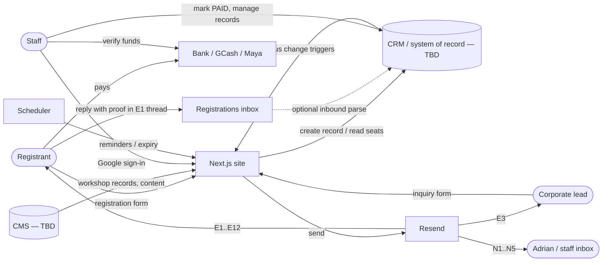
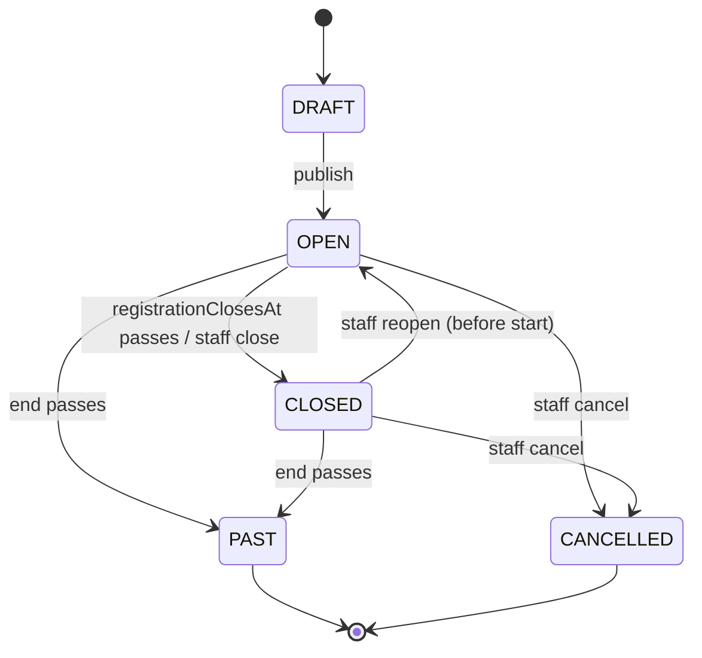
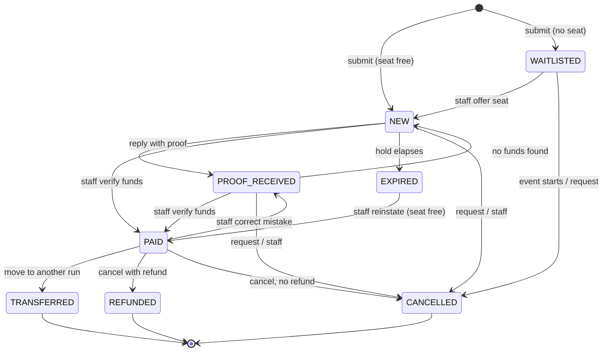
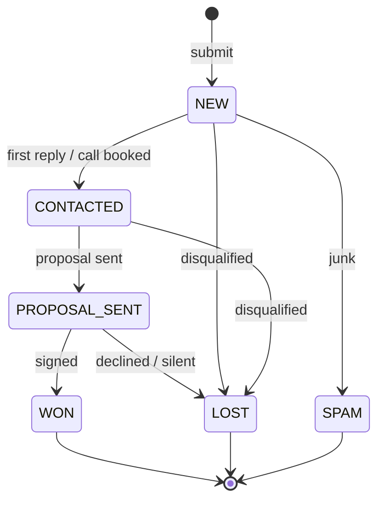

# Functional Specification: Coach Adrian Ding site, Phase 2 backend

## 0. Document info

| Field    | Value                                                                                                                                               |
| -------- | --------------------------------------------------------------------------------------------------------------------------------------------------- |
| Version  | 0.1                                                                                                                                                 |
| Date     | 2026-09-30                                                                                                                                          |
| Owner    | Chan / Iridel                                                                                                                                       |
| Status   | **Draft for handoff.** Only acted on at Phase 2 handoff; the demo does not implement it                                                             |
| Audience | Iridel dev team building the real backend (forms, CRM, emails, payments, CMS, auth)                                                                 |
| Sources  | [README](../../README.md), [PRD](PRD.md), [meeting notes](../meetings/MEETING-NOTES.md), [historical feedback](../feedback-passes/index.md), `src/` |

### How to read this doc

- **§3 Conventions** first. Status names, reference IDs, timezone and money rules are used everywhere after it.
- **§4 Functional flows** is the core. Each flow has the same shape: trigger, actors, preconditions, a step table (`# | actor | action | system response | data written | email sent`), status transitions, edge cases, acceptance criteria, and "Demo today vs. to build".
- **§5 Data model** and **§6 State machines** are the contract behind the flows. If a flow and a state machine disagree, the state machine wins. Tell Chan about the conflict.
- **§7 Email catalogue** lists every email by ID (`E1`, `N1`, ...). Flows refer to emails by ID only.
- Tags:
  - **(proposed)** means the item was inferred or designed for this spec. Nobody decided it and it isn't in the code, so confirm it before building.
  - Anything untagged was either decided (§11 has the date) or found in the code or docs (file path cited).
  - **[OPEN-n]** points to an open decision in §11.2.
- **PM: everything to run by the client is in §11.2 Open decisions.** Filter the Owner column for "Client". It is the only list: items raised elsewhere in the doc (field purposes in §9.2, the seat hold in §3.7, the contradictions in §11.3 that need a client answer) all have a row there. Record each answer in §11.1 with the date.
- The CRM is **not chosen** (team's decision, §11.2). The spec describes entities, fields, statuses and triggers in a way that doesn't depend on the tool. "System" means the Phase 2 backend: Next.js server code plus whichever CRM/DB the team picks.

---

## 1. Purpose & scope

The demo shows every form and post-submit page as frontend-only UI. Nothing is stored or sent, and no one can sign in. This document specifies the behaviour Phase 2 must build behind that UI.

### In scope

- Workshop registration: submit, reference ID, seat hold, payment instructions, proof of payment, staff verification, payment confirmation.
- Payment lifecycle: reminders, hold expiry, cancellation, refund, transfer to another run, substitution, sold-out and waitlist handling, duplicate submissions, capacity.
- Organiser-side changes to a workshop: reschedule or cancel (proposed).
- Pre-event communications: primer / prep email and day-before reminder (proposed), plus attendance.
- Corporate training inquiry: submit, acknowledgment, internal notification, sales pipeline.
- Other forms. **None exist today** (§4.10). Contact is by `mailto:` / `tel:` / `sms:` links only.
- CMS / admin: workshops (dates, seats, price, course code, primer videos, payment details) and the other content collections. OG cards are **derived from the workshop record, never an upload field**.
- Staff authentication and roles.
- Consent and privacy under the Philippine Data Privacy Act of 2012 (RA 10173).

### Out of scope

- Online payment gateways (card, GCash/Maya API, PayMongo, etc.). Payment is manual (§11.1).
- Public user accounts. Only staff sign in (`PRD.md` → Auth).
- **Gallery**, entirely: no CMS collection, no new work. Removed from this scope for budget (decided 2026-09-30). The gallery code stays in the demo so a later scope update can pick it up.
- Newsletter / mailing list. Nothing in the demo or docs asks for one (§12).
- Official receipt (BIR) generation. It is issued outside the system; the spec only records it (§4.6, [OPEN-6]).

---

## 2. System overview

### Actors

| Actor              | Who                                                                                           | Interacts via                                            |
| ------------------ | --------------------------------------------------------------------------------------------- | -------------------------------------------------------- |
| **Registrant**     | Individual professional registering for a public workshop (usually from a per-course ad link) | Workshop page form, `/registered` page, email thread     |
| **Corporate lead** | HR / L&D decision-maker at a company                                                          | Corporate inquiry form, `/inquiry-received` page, email  |
| **Adrian**         | Coach Adrian Ding, owner and trainer                                                          | Receives owner notifications; CMS admin; reads inquiries |
| **Staff / admin**  | Adrian's team (client side) who verify payments and manage records                            | `/staff-login` → CRM + CMS                               |
| **System**         | Next.js site + server code + CRM/DB [TBD] + scheduler                                         | —                                                        |

### Systems

| System                       | Role                                                                                                 | Status                                                 |
| ---------------------------- | ---------------------------------------------------------------------------------------------------- | ------------------------------------------------------ |
| Next.js site (this repo)     | Public pages, forms, confirmation pages, OG cards, server actions/route handlers, admin UI if needed | Frontend built; backend not built                      |
| CRM / system of record [TBD] | Registrations, inquiries, waitlist, counters, status history                                         | Team's decision ([OPEN-1])                             |
| CMS [TBD]                    | Workshop catalogue and other content collections                                                     | Team's decision ([OPEN-2])                             |
| Resend                       | Transactional email out; inbound email optional ([OPEN-3])                                           | Decided 2026-09-30                                     |
| Bank / GCash / Maya          | Registrant pays outside the system; staff check receipt of funds by hand in those accounts           | Decided 2026-09-30; account details pending ([OPEN-7]) |
| Scheduler (proposed)         | Reminder, expiry and pre-event jobs (e.g. Vercel Cron hitting a protected route)                     | Not built                                              |
| Google OAuth                 | Staff sign-in                                                                                        | UI shell only                                          |

### Context diagram

---

## 3. Conventions

### 3.1 Reference IDs

**Registrations.** Format: `AD-<COURSE>-<####>`, e.g. `AD-PSW-0042`. Decided 2026-09-30.

- `<COURSE>` is the workshop record's `courseCode` field (§5.1).
  - 2–5 uppercase letters A–Z, unique across courses. (proposed: 2–5)
  - Staff enter it in the CMS. The editor pre-fills a suggestion from the title's initials, and staff can override it. (proposed)
  - **Immutable once any registration references it.** The CMS must lock the field once registrations exist.
  - Reruns of the same course share one `courseCode`, so the sequence carries on across runs rather than restarting at 0001. That keeps IDs globally unique without a date part. (proposed, [OPEN-8])
- `<####>` is a per-`courseCode` sequence, zero-padded to 4 digits. After 9999 it widens to 5 digits and is never truncated.
- **Race-safe issuance is required.** Two submissions arriving together must never get the same number.
  - Issue the number with a single atomic operation in the system of record. Examples: `INSERT ... ON CONFLICT (course_code) DO UPDATE SET last = last + 1 RETURNING last` on a counter table, Redis `INCR`, or a CRM-native atomic counter.
  - "Read max, add 1, write" is **not acceptable**.
  - Also put a unique constraint on `referenceId`. If the CRM can't do atomic increments (see §11.2 criteria), a small counter store beside it owns the sequence.
- Gaps are allowed. A number issued to a submission that later fails validation or is rolled back is never reused.
- Assign the ID when the record is created, including `WAITLISTED` records.
- **Where it appears:**
  - the `/registered` page;
  - the subject of every registrant email;
  - the payment instructions: "put this in the transfer note / message";
  - the CRM record title;
  - owner notifications.
- The registrant puts it in the bank transfer note or GCash/Maya message. Staff match funds to records by it.
- Case-insensitive lookup; always displayed uppercase.

**Corporate inquiries.** No format is decided. Proposed: `AD-CORP-<####>`, same mechanics, one sequence ([OPEN-9]).

### 3.2 Status names

- `UPPER_SNAKE_CASE`, stored as an enum, never free text.
- Registration statuses are in §6.2 and inquiry statuses in §6.3.
- `NEW` is the entry status for every form submission. It comes from the lead-capture contract, `PRD.md` → "Phase 2 handoff — lead capture".

### 3.3 Time

- Business timezone is **Asia/Manila (UTC+08:00, no DST)**.
- Store timestamps as UTC ISO-8601. Display them in Asia/Manila.
- Workshop `start` already carries `+08:00` in `src/lib/workshops.ts`.
- "Business day" means Mon–Fri excluding PH regular holidays. (proposed; the holiday list is a config value the client maintains.)

### 3.4 Money

- Currency is **PHP**. Store amounts as integer centavos (`650000` = ₱6,500.00) (proposed). Display as `₱6,500`.
- The trailing `*` in today's `price` strings (`"₱6,500*"`) is a demo "indicative" marker. Drop it in Phase 2.
- `price` becomes a number plus a display formatter, not a string.

### 3.5 Email sender and reply-to

| Setting                | Value                                                                                                                                                                                            |
| ---------------------- | ------------------------------------------------------------------------------------------------------------------------------------------------------------------------------------------------ |
| Provider               | Resend (decided 2026-09-30)                                                                                                                                                                      |
| From                   | `Coach Adrian Ding <no-reply@…>` is **not** used, because every registrant email must be replyable. Use `Coach Adrian Ding <registrations@<sending-domain>>` (proposed). Sending domain [OPEN-4] |
| Reply-To, registration | A monitored registrations inbox. Proof-of-payment replies land here (§4.2). Must be the same address for E1, E4, E5 so the thread stays in one mailbox                                           |
| Reply-To, corporate    | Inbox Adrian's team reads for sales. The site's public address today is `coachadrianding@maximumimpact.online` (`site-footer.tsx`, `templates.tsx`)                                              |
| Subject rule           | Every registrant email subject starts with `[<referenceId>]`, e.g. `[AD-PSW-0042] You're registered — Exceptional Salesmanship, Oct 9` (proposed prefix position)                                |
| Threading              | Store the Resend `Message-ID` of E1 on the registration. Later registrant emails set `In-Reply-To` / `References` to it, so they thread under the original in most clients (proposed)            |

### 3.6 Identity normalisation

- Emails: trim and lowercase before storing and comparing.
- Phone: store E.164 (`+639171234567`), normalised from local `09xx` input (proposed). Keep the raw input too.

### 3.7 Seat hold

Registering doesn't confirm a seat; payment does. Between the two, the registrant has a **seat hold**: their seat is reserved for them (48 hours proposed, [OPEN-5]) while they pay.

- A held seat counts against capacity, so nobody else can take it in the meantime.
- It becomes a confirmed seat when staff mark the registration `PAID`.
- If it runs out unpaid, the registration moves to `EXPIRED` and the seat goes back on sale (§4.3).

Without holds, a workshop could fill up with people who never pay, or sell the same last seat to two people who both pay.

---

## 4. Functional flows

### 4.1 Workshop registration (submit)

**Trigger:** registrant submits the 3-step form in the registration dialog on `/workshops/[slug]`.
**Actors:** Registrant, System.
**Preconditions:**

- The workshop `status = OPEN` and `now < registrationClosesAt` (§5.1).
- Seats are available (else §4.4).
- The form passes client-side validation (schema in `registration-form.tsx` L37–49).

| #   | Actor      | Action                                                | System response                                                                                                                                                                                                  | Data written                                                                                                                              | Email sent          |
| --- | ---------- | ----------------------------------------------------- | ---------------------------------------------------------------------------------------------------------------------------------------------------------------------------------------------------------------- | ----------------------------------------------------------------------------------------------------------------------------------------- | ------------------- |
| 1   | Registrant | Opens the dialog, fills step 1 (name, email, mobile)  | Validates each step before advancing                                                                                                                                                                             | —                                                                                                                                         | —                   |
| 2   | Registrant | Step 2 (occupation, salary range, city optional)      | Same                                                                                                                                                                                                             | —                                                                                                                                         | —                   |
| 3   | Registrant | Step 3: reviews summary, ticks DPA consent, submits   | Button disables ("Reserving your seat…"). Sends payload + idempotency key (proposed) + anti-spam token                                                                                                           | —                                                                                                                                         | —                   |
| 4   | System     | Server-side validation                                | Re-validates with the same Zod schema on the server, checks honeypot/Turnstile (§9.3), and checks the workshop is still `OPEN` and before cutoff. On failure returns field errors; the visitor stays on the form | —                                                                                                                                         | —                   |
| 5   | System     | Duplicate check                                       | If an active registration already exists for this email + workshop, stop here and go to §4.5                                                                                                                     | —                                                                                                                                         | —                   |
| 6   | System     | Seat check + create record **in one transaction**     | Counts seats held (§5.1 `seatsLeft`). If one is free: issue reference ID (§3.1) and insert the registration. If none: go to §4.4                                                                                 | `Registration` {status `NEW`, referenceId, workshopId, attendee fields, consent fields, `holdExpiresAt`, source/UTM}; `StatusHistory` row | —                   |
| 7   | System     | Record write fails                                    | Visitor sees an inline error ("We couldn't save your registration — please try again or call 0920 900 7709") and is **not** routed to the confirmation page. Nothing is emailed                                  | Error log                                                                                                                                 | —                   |
| 8   | System     | Send registrant email (after the record is committed) | Queue E1. A send failure never rolls back the record: retry with backoff (proposed: 3 tries over ~15 min), then alert staff                                                                                      | `EmailLog` {E1, messageId, status}; `Registration.e1MessageId`                                                                            | **E1** → registrant |
| 9   | System     | Notify owners                                         | Queue N1 to the configured owner recipients                                                                                                                                                                      | `EmailLog`                                                                                                                                | **N1** → owners     |
| 10  | System     | Route registrant                                      | Redirect to `/workshops/[slug]/registered` carrying the reference ID. The page shows the greeting, reference ID, amount, payment block, tracker, primer video, and what to expect                                | Client handoff (today `sessionStorage`) now also carries `referenceId` and `holdExpiresAt`                                                | —                   |

**Status transitions:** (none) → `NEW`.

**Edge cases & errors**

- **Double click / network retry.** The idempotency key (client-generated UUID per form open) makes the server return the first result for a repeated key within 24h (proposed). Belt and braces with §4.5.
- **Workshop filled while the dialog was open.** Step 6 finds no seat, so the flow goes to §4.4 and the registrant sees "Just sold out — you're on the waitlist" rather than a success page.
- **Registration closed mid-form** (cutoff passed or status changed). Show an error with a link to `/workshops` and to the corporate/contact channels.
- **Hold window vs event start.** `holdExpiresAt = min(createdAt + HOLD_HOURS, workshop.start − HOLD_CUTOFF_HOURS)`. Proposed: HOLD_HOURS = 48 (pending client sign-off, [OPEN-5]); HOLD_CUTOFF_HOURS = 12. If the result is ≤ now + 2h, registration should already be closed (`registrationClosesAt`).
- **Direct visit to `/registered`** (no handoff, private mode, shared link). Render the generic state. This already works: every consumer handles `null` (`src/app/_lib/handoff.ts`). The generic state must **not** show someone else's data. The page never fetches a registration by a guessable URL (proposed: if a lookup is added, use a signed token, never the bare reference ID).
- **Salary range "Prefer not to say"** is a valid value.
- **City** is optional. Store null, not "".
- **Past workshop page.** No form renders (`page.tsx` shows `PastCta`). The server also rejects submissions for non-`OPEN` workshops.

**Acceptance criteria**

- Given an open workshop with free seats, when a valid form is submitted, then exactly one `Registration` with status `NEW` and a unique `AD-<COURSE>-<####>` ID exists, E1 and N1 are queued, and the registrant lands on `/registered`, which shows that ID.
- Given the record write fails, when the registrant submits, then they stay on the form with an error, and no email is sent.
- Given the record is written but Resend errors, when the registrant submits, then they still reach `/registered`, the record stays `NEW`, E1 is retried, and staff are alerted if every retry fails.
- Given 20 concurrent valid submissions for the same course, then 20 distinct, consecutive-or-gapped sequence numbers are issued and none repeats.
- Given the same idempotency key is posted twice, then one record exists.

**Demo today vs. to build**

- Today: `onSubmit` (`registration-form.tsx` L131–141) writes `{kind, slug, fullName, email, phone}` to `sessionStorage` and routes. No server, record, reference ID or email.
- To build: steps 4–10.
- Also change the `/registered` page:
  - add the reference ID and amount;
  - replace the payment block's "Reference: Your full name + {title}" (`payment.tsx` L85–90) with the reference ID;
  - add Maya;
  - put real account details in place of the placeholders.
- Remove `DemoFillButton` (`README.md` → Temporary review tools).

---

### 4.2 Payment: proof of payment and staff verification

**Trigger:** registrant pays by bank transfer, GCash or Maya, then replies to the E1 thread with proof.
**Actors:** Registrant, Staff, System.
**Preconditions:** registration in `NEW` (or `EXPIRED`, see edge cases); E1 delivered with the reference ID and payment details.

| #   | Actor      | Action                                                                                                                                                                       | System response                                                          | Data written                                                                                                                                                   | Email sent                |
| --- | ---------- | ---------------------------------------------------------------------------------------------------------------------------------------------------------------------------- | ------------------------------------------------------------------------ | -------------------------------------------------------------------------------------------------------------------------------------------------------------- | ------------------------- |
| 1   | Registrant | Transfers the fee and puts the reference ID in the transfer note / e-wallet message                                                                                          | —                                                                        | —                                                                                                                                                              | —                         |
| 2   | Registrant | Replies to E1 with a screenshot/photo of the payment (and billing details if they want an official receipt; `workshop-faq.ts`)                                               | Reply lands in the registrations inbox (§3.5)                            | —                                                                                                                                                              | —                         |
| 3a  | Staff      | **Manual capture (baseline):** finds the record by the reference ID in the subject, sets `PROOF_RECEIVED`, attaches or links the proof                                       | Hold expiry pauses (proposed)                                            | `Registration.status = PROOF_RECEIVED`, `proofReceivedAt`, `proofFiles[]` (restricted), StatusHistory                                                          | —                         |
| 3b  | System     | **Inbound capture (optional, [OPEN-3]):** Resend inbound webhook receives the reply, extracts `AD-XXX-####` from the subject/body, stores attachments, sets `PROOF_RECEIVED` | Unmatched replies go to a staff review queue, never dropped              | Same as 3a + `InboundEmail` row                                                                                                                                | **N2** → staff (proposed) |
| 4   | Staff      | Checks the bank / GCash / Maya account for the funds (amount + reference)                                                                                                    | —                                                                        | —                                                                                                                                                              | —                         |
| 5   | Staff      | Marks the registration **PAID** in the CRM, entering amount received, method, payer name, provider transaction ref, date received                                            | Validates required payment fields; blocks if the workshop is `CANCELLED` | `status = PAID`, `paidAt`, `paymentMethod` (`BANK` \| `GCASH` \| `MAYA`), `amountReceivedCentavos`, `payerName`, `providerTxnRef`, `verifiedBy`, StatusHistory | —                         |
| 6   | System     | Status-change trigger on → `PAID`                                                                                                                                            | Sends E2 **once per registration** (idempotent on `e2SentAt`)            | `EmailLog`, `e2SentAt`                                                                                                                                         | **E2** → registrant       |

**Status transitions:** `NEW` → `PROOF_RECEIVED` → `PAID`. `NEW` → `PAID` directly is allowed, for when staff see funds before any reply.

**Edge cases & errors**

- **Wrong or partial amount.** Staff don't mark `PAID`. They record `amountReceivedCentavos` and a note, then reply in the thread by hand. Overpayment: mark `PAID` and refund the difference outside the system, with a note (proposed).
- **No reference in the transfer note.** Staff match by payer name, amount and date. The UI needs search by name/email/amount (§8.2).
- **Proof arrives after `EXPIRED`.** Staff may reinstate: `EXPIRED` → `PAID` if a seat is free, otherwise offer transfer or refund (proposed). The system must re-check capacity on reinstatement.
- **Proof arrives but no funds found.** Staff revert `PROOF_RECEIVED` → `NEW`. The hold resumes, with a minimum of 12h left (proposed), and staff reply by hand.
- **Mark PAID by mistake.** Staff can revert `PAID` → `PROOF_RECEIVED` with a mandatory reason. E2 is **not** re-sent on a second `PAID` (idempotent flag), and no "unconfirm" email is automated (proposed).
- **Company pays / wants an official receipt.** Capture `billingName`, `billingAddress`, `billingTin` (optional) and `orRequested` from the reply. The OR itself is issued outside the system; staff record `orNumber` and `orIssuedAt` ([OPEN-6]).
- **Proof images contain financial data.** Store them with restricted access, apply a retention policy, and never attach them to notification emails (§9.1).

**Acceptance criteria**

- Given a registration in `NEW` or `PROOF_RECEIVED`, when staff mark it `PAID` with the required payment fields, then its status is `PAID` and E2 goes to the attendee email exactly once.
- Given a registration already `PAID`, when staff save it as `PAID` again, then no second E2 is sent.
- Given a registration in `PROOF_RECEIVED`, when its `holdExpiresAt` passes, then it does not expire.
- Given inbound capture is enabled and a reply's subject contains a valid reference ID, then that registration moves to `PROOF_RECEIVED` and its attachments are stored against it. Given no valid ID is found, then the email appears in the review queue.

**Demo today vs. to build**

- Today: the reply-with-proof instruction exists in copy (`payment.tsx`, `workshop-faq.ts`, E1 preview).
- `/staff-login` is inert (`src/app/staff-login/page.tsx`). No dashboard, no status, no send.
- To build: the capture path (3a, and 3b if chosen), the PAID action with its fields, and the E2 trigger.

---

### 4.3 Hold reminder and expiry

**Trigger:** scheduler (proposed: every 15 min).
**Actors:** System.
**Preconditions:** registration in `NEW` with `holdExpiresAt` set.

| #   | Actor  | Action                                                                                             | System response                                                | Data written                                   | Email sent                     |
| --- | ------ | -------------------------------------------------------------------------------------------------- | -------------------------------------------------------------- | ---------------------------------------------- | ------------------------------ |
| 1   | System | Finds `NEW` registrations where `now ≥ holdExpiresAt − REMINDER_LEAD_HOURS` and `e4SentAt` is null | Sends the payment reminder (proposed REMINDER_LEAD_HOURS = 24) | `e4SentAt`, EmailLog                           | **E4** → registrant            |
| 2   | System | Finds `NEW` registrations where `now ≥ holdExpiresAt`                                              | Sets `EXPIRED` and releases the seat                           | `status = EXPIRED`, `expiredAt`, StatusHistory | **E5** → registrant (proposed) |
| 3   | System | If the workshop has `WAITLISTED` registrations                                                     | Notifies staff that a seat freed up (§4.4)                     | —                                              | **N5** → staff (proposed)      |

**Status transitions:** `NEW` → `EXPIRED`.

**Edge cases**

- `PROOF_RECEIVED` never expires automatically (proposed; see §4.2).
- Staff can **extend a hold**: set a new `holdExpiresAt` with a reason (proposed). E4 can be re-armed by clearing `e4SentAt`.
- If the hold is shorter than REMINDER_LEAD_HOURS (e.g. a late registration), skip E4 and send E5 only.
- Jobs must be idempotent. Two overlapping runs must not double-send (use the `e4SentAt` / status guard in the same update).

**Acceptance criteria**

- Given a `NEW` registration whose hold ends in 23h, when the job runs, then E4 is sent once.
- Given a `NEW` registration past `holdExpiresAt`, when the job runs, then it becomes `EXPIRED`, `seatsLeft` goes up by 1, and E5 is sent.
- Given a `PROOF_RECEIVED` registration past `holdExpiresAt`, then nothing changes.

**Demo today vs. to build**

- Today: "held for 48 hours" is copy only (`payment.tsx` L26, `workshop-faq.ts`), flagged `TODO: client sign-off`. No scheduler exists.
- To build: the scheduler route, E4, E5 and the configuration values.

---

### 4.4 Capacity, sold out and waitlist

**Trigger:** a submission finds `seatsLeft = 0`, or a registrant uses "Join waitlist".
**Actors:** Registrant, Staff, System.
**Preconditions:** workshop `OPEN`.

Seat accounting (proposed):

- `seatsLeft = seatsTotal − count(registrations in NEW, PROOF_RECEIVED, PAID)`.
- Unpaid holds consume seats: that is what "your seat is held" promises.
- `seatsLeft` is **derived and never hand-edited**. Today it is a static field in `workshops.ts`.
- Pages that show seat counts must revalidate after every seat-changing transition, or read the count live. Pages that show it: hero, overview, register CTA, sticky bar, payment block.

| #   | Actor      | Action                                                             | System response                                                                                              | Data written                                          | Email sent                                                |
| --- | ---------- | ------------------------------------------------------------------ | ------------------------------------------------------------------------------------------------------------ | ----------------------------------------------------- | --------------------------------------------------------- |
| 1   | Registrant | Submits when no seat is free (or via "Join waitlist")              | Creates the registration as `WAITLISTED` with a reference ID and **no hold** and no payment instructions     | `Registration {status: WAITLISTED, waitlistPosition}` | **E8** → registrant; **N1** → owners (flagged "waitlist") |
| 2   | System     | Routes registrant                                                  | Waitlist confirmation state on `/registered` (proposed: same route, variant copy: no payment block, no hold) | —                                                     | —                                                         |
| 3   | System     | A seat frees (expiry, cancellation, transfer out, capacity raised) | Notifies staff                                                                                               | —                                                     | **N5** → staff                                            |
| 4   | Staff      | Offers the seat to the next person (manual, proposed; [OPEN-10])   | Moves `WAITLISTED` → `NEW` with a fresh hold                                                                 | `status = NEW`, `holdExpiresAt`, StatusHistory        | **E1** (variant: "a seat opened up")                      |

**Status transitions:** (none) → `WAITLISTED`; `WAITLISTED` → `NEW`; `WAITLISTED` → `CANCELLED` (at event start or on request).

**Edge cases**

- The capacity check and insert must be atomic (same transaction as §3.1), so the last seat can't be sold twice.
- **Staff lower `seatsTotal` below the number of held seats.** Allow it with a warning. Existing holds are kept, and `seatsLeft` shows 0, never a negative number.
- At the workshop start, the scheduler moves remaining `WAITLISTED` records to `CANCELLED` (proposed), with no email or with E12 wording ([OPEN-10]).

**Acceptance criteria**

- Given `seatsLeft = 1` and two simultaneous submissions, then exactly one is `NEW` and the other is `WAITLISTED`.
- Given `seatsLeft = 0`, when the page renders, then no CTA says "Register now". It says "Join waitlist" or is hidden, per [OPEN-10].

**Demo today vs. to build (contradictions)**

- The sticky bar shows "Fully booked — join the waitlist" / "Join waitlist" at `seatsLeft <= 0` (`sticky-register-bar.tsx` L52–55, L90). Its button opens the **normal registration form**, which would create a normal registration.
- `register-cta.tsx` L15–19 shows "Fully booked" but keeps a "Register now" button.
- `payment.tsx` L29 says seats are "released back to the waiting list". No waitlist exists anywhere.
- To build: all of the above, plus a waitlist mode for the form (same fields, different submit label and copy).

---

### 4.5 Duplicate submissions

**Trigger:** a submission's normalised email matches an existing registration for the same workshop in `NEW`, `PROOF_RECEIVED`, `PAID` or `WAITLISTED`.
**Actors:** Registrant, System.

| #   | Actor  | Action                | System response                                                                                                                               | Data written                                             | Email sent                                                                                              |
| --- | ------ | --------------------- | --------------------------------------------------------------------------------------------------------------------------------------------- | -------------------------------------------------------- | ------------------------------------------------------------------------------------------------------- |
| 1   | System | Detects the duplicate | Does **not** create a second record or take a second seat. Routes to `/registered` showing the **existing** reference ID and state (proposed) | `Registration.duplicateAttempts += 1`, `lastDuplicateAt` | E1 re-sent only if the status is `NEW`, max once per 10 min (proposed); E2 re-sent if `PAID` (proposed) |
| 2   | System | Changed details       | If the name or phone differs, keep the original and record the new values in a note for staff (proposed). No silent overwrite                 | Note                                                     | —                                                                                                       |

**Edge cases**

- **Same person registering a colleague.** They must use the colleague's email. If they use their own again, the duplicate rule applies.
- **Group bookings** of ten or more should be routed to a corporate inquiry (`workshop-faq.ts` "Group rates apply from ten attendees"). Multi-seat booking is out of scope (§12).
- **Previous registration `EXPIRED` or `CANCELLED`.** Treat it as new: create a new record with a new reference ID.

**Acceptance criteria**

- Given an active registration for `a@x.com` on workshop W, when `A@X.com ` submits for W again, then there is still one active record, and the page shows the original reference ID.

**Demo today vs. to build:** nothing is stored, so there's no dedupe. Build all of it.

---

### 4.6 Registrant changes: substitution, transfer, cancellation, refund

**Trigger:** the registrant asks by replying in the thread (the only channel; there's no self-service, proposed).
**Actors:** Registrant, Staff, System.
**Policy source:** `src/lib/workshop-faq.ts`, all flagged `TODO: client sign-off` ([OPEN-5]):

- **Substitution:** free up to three days before the workshop.
- **Transfer:** to the next run of the same workshop, with at least seven days' notice.
- **Refund:** no policy exists anywhere ([OPEN-11]).

| #   | Actor | Action                                                               | System response                                                                                                                                                                           | Data written                                                                               | Email sent                                                |
| --- | ----- | -------------------------------------------------------------------- | ----------------------------------------------------------------------------------------------------------------------------------------------------------------------------------------- | ------------------------------------------------------------------------------------------ | --------------------------------------------------------- |
| S1  | Staff | **Substitute**: replaces the attendee name/email/phone on the record | Warns if within the 3-day window (policy, not a hard block). The reference ID is kept                                                                                                     | Attendee fields updated; `substitutions[]` {old, new, at, by}; StatusHistory note          | E2 re-issued to the **new** attendee if `PAID` (proposed) |
| T1  | Staff | **Transfer** to another workshop run                                 | Checks the target is `OPEN` with a seat. Creates a new registration on the target with a **new** reference ID and the same status (`PAID` carries over). The source becomes `TRANSFERRED` | Source: `status = TRANSFERRED`, `transferredToId`; target: new record, `transferredFromId` | **E11** → registrant (proposed)                           |
| C1  | Staff | **Cancel before payment** (registrant asks, or staff clean-up)       | Releases the seat                                                                                                                                                                         | `status = CANCELLED`, `cancelReason`                                                       | **E10** (proposed)                                        |
| C2  | Staff | **Cancel after payment, with refund**                                | Records the refund done outside the system (bank/e-wallet)                                                                                                                                | `status = REFUNDED`, `refundAmountCentavos`, `refundedAt`, `refundMethod`, `refundRef`     | **E10** (refund variant, proposed)                        |
| C3  | Staff | **Cancel after payment, no refund** (per policy)                     | Releases the seat                                                                                                                                                                         | `status = CANCELLED`, `cancelReason = "no-refund policy"`                                  | **E10**                                                   |

**Edge cases**

- **No later run exists.** The transfer can't be completed. Keep the registration `PAID` with a "transfer pending" flag (proposed) until a run is published.
- **Transfer target is full.** Block the transfer, or waitlist on the target at staff's discretion.
- **Partial refund.** Allowed; the amount is recorded.
- Every seat-releasing transition (C1–C3, T1 source) triggers N5 when a waitlist exists.

**Acceptance criteria**

- Given a `PAID` registration, when staff transfer it to an open run with seats, then the source is `TRANSFERRED`, the target is `PAID` with a new ID linked both ways, both workshops' `seatsLeft` update, and E11 is sent.
- Given a substitution on a `PAID` record, then the reference ID doesn't change and the new attendee receives E2.

**Demo today vs. to build:** policy copy only, in the FAQ. Build all of it.

---

### 4.7 Organiser changes: workshop rescheduled or cancelled (proposed)

**Trigger:** staff edit a workshop's `start`/`schedule`/`venue`, or set it `CANCELLED`, in the CMS.
**Actors:** Staff, System.

| #   | Actor | Action                                                              | System response                                                                                                 | Data written                         | Email sent                                                                   |
| --- | ----- | ------------------------------------------------------------------- | --------------------------------------------------------------------------------------------------------------- | ------------------------------------ | ---------------------------------------------------------------------------- |
| 1   | Staff | Changes date, time or venue of a workshop with active registrations | Confirmation prompt: "N registrants will be notified". Revalidates the pages and OG card (§8.1)                 | Workshop fields; `WorkshopChangeLog` | **E12** (change variant) → all `NEW`, `PROOF_RECEIVED`, `PAID`, `WAITLISTED` |
| 2   | Staff | Sets the workshop `CANCELLED`                                       | Registration closes. Existing registrations stay in their status until staff transfer or refund each one (§4.6) | `status = CANCELLED`                 | **E12** (cancel variant) → same set                                          |

**Acceptance criteria**

- Given a workshop with 5 `PAID` and 2 `NEW` registrations, when its date changes, then 7 E12 emails are sent, and the OG card and pages show the new date after revalidation.

**Demo today:** `status` is only `"open" | "past"` (`workshops.ts`). There is no cancel state. Build all of it.

---

### 4.8 Pre-event communications and attendance

**Trigger:** scheduler, relative to `workshop.start`.
**Actors:** System, Staff.

| #   | Actor  | Action                                                                | System response                                                                                                                                                              | Data written                       | Email sent        |
| --- | ------ | --------------------------------------------------------------------- | ---------------------------------------------------------------------------------------------------------------------------------------------------------------------------- | ---------------------------------- | ----------------- |
| 1   | System | At `start − 7 days`: primer / prep email to every `PAID` registration | Prep notes, venue map, primer video link. A registration that becomes `PAID` after this point gets E6 immediately after E2 (proposed; see [OPEN-12] for the overlap with E2) | `e6SentAt`                         | **E6** (proposed) |
| 2   | System | At `start − 1 day` (proposed 09:00 Asia/Manila)                       | Logistics recap                                                                                                                                                              | `e7SentAt`                         | **E7** (proposed) |
| 3   | Staff  | On the day: marks attendance from the attendee list                   | —                                                                                                                                                                            | `attendance = ATTENDED \| NO_SHOW` | —                 |
| 4   | System | After `start` + duration                                              | Workshop status → `PAST` (proposed automatic)                                                                                                                                | Workshop `status = PAST`           | —                 |

**Acceptance criteria**

- Given a `PAID` registration 7 days before start, when the job runs, then E6 is sent once.
- Given a registration paid 3 days before start, then it receives E2 and then E6 without waiting.

**Demo today vs. to build**

- The tracker's step 4 promises a "Primer email — prep notes and the venue map, a week out" (`confirmed.tsx` L42–43), and `primer.tsx` L22 repeats it.
- The E2 preview says "We'll also send a reminder the day before" (`templates.tsx`).
- Neither email has a template. Attendance is a new field.

---

### 4.9 Corporate training inquiry

**Trigger:** corporate lead submits the 4-step inquiry form on `/corporate-training` (`#inquiry`), optionally prefilled via `?program=<key>#inquiry`.
**Actors:** Corporate lead, Adrian / staff, System.
**Preconditions:** client validation passes (schema in `inquiry-form.tsx` L96–109).

| #   | Actor          | Action                                                                                                          | System response                                                                                                                                                          | Data written                                                                                                                   | Email sent                     |
| --- | -------------- | --------------------------------------------------------------------------------------------------------------- | ------------------------------------------------------------------------------------------------------------------------------------------------------------------------ | ------------------------------------------------------------------------------------------------------------------------------ | ------------------------------ |
| 1   | Corporate lead | Steps 1–3: details, company/role, programme + also-interested + attendee band + possible date + venue + context | Step validation; prefill from `?program=` / carousel event                                                                                                               | —                                                                                                                              | —                              |
| 2   | Corporate lead | Step 4: reviews, ticks DPA consent, submits                                                                     | Server validation + spam checks (§9.3)                                                                                                                                   | —                                                                                                                              | —                              |
| 3   | System         | Creates the record **first**                                                                                    | On failure: inline error; no confirmation page, no email                                                                                                                 | `Inquiry {status: NEW, referenceId (proposed), fields, consent, prefilledProgramKey, source/UTM, slaDueAt = +2 business days}` | —                              |
| 4   | System         | Sends email **second**                                                                                          | Retries on failure; the record is kept                                                                                                                                   | EmailLog                                                                                                                       | **E3** → lead; **N3** → owners |
| 5   | System         | Routes                                                                                                          | `/corporate-training/inquiry-received`: greeting, company, the 3 next steps, the 2-business-day commitment, a playback of the submitted data, the corporate primer video | Handoff                                                                                                                        | —                              |
| 6   | Adrian / staff | Replies, holds a discovery call                                                                                 | Sets `CONTACTED`                                                                                                                                                         | `status`, `contactedAt`, `owner`                                                                                               | —                              |
| 7   | Staff          | Sends the written proposal (outside the system)                                                                 | Sets `PROPOSAL_SENT`                                                                                                                                                     | `proposalSentAt`, optional `proposalValueCentavos`                                                                             | —                              |
| 8   | Staff          | Records the outcome                                                                                             | `WON` / `LOST`, with a reason                                                                                                                                            | `closedAt`, `lostReason`                                                                                                       | —                              |
| 9   | System         | SLA watch (proposed): `NEW` past `slaDueAt`                                                                     | Internal nudge                                                                                                                                                           | —                                                                                                                              | **N4** → owners                |

**Status transitions:** `NEW` → `CONTACTED` → `PROPOSAL_SENT` → `WON` | `LOST`. Any status can go to `LOST`, and `NEW` can go to `SPAM`. All stages after `NEW` are proposed; README §D listed them as unconfirmed.

**Edge cases**

- **Store programmes by key, not title.** Today the form stores titles (`program: z.enum(PROGRAMS)`, `alsoInterested: SPEC_TITLES`). "Not sure yet — help us scope it" becomes key `undecided` (proposed). Keys are stable if titles change in the CMS.
- **Possible date.** Today it is composed into one display string (`composeDateRange`). Store `targetDateMode` (`PICK` | `TEXT`), `targetDateFrom`, `targetDateTo`, `targetDateText`, plus the composed string (proposed).
- **Duplicate inquiries.** Same email within 24h: create a new record, linked as `possibleDuplicateOf` (proposed; sales data should not be lost). N3 is marked "follow-up".
- **Unknown `?program=` key.** Already ignored silently (`applyProgram`). Keep that.
- **Primary programme also ticked in "also interested".** Already stripped client-side. Strip it server-side too.
- The 2-business-day promise and "Adrian reads every inquiry himself" are `TODO: client sign-off` (`commitment.tsx`) ([OPEN-5]).

**Acceptance criteria**

- Given a valid inquiry, when it is submitted, then one `Inquiry` in `NEW` exists with programme keys, E3 is sent to the lead (the panel reflects the submitted programme, attendees, date, venue), N3 is sent to the owners, and the lead lands on `/inquiry-received`.
- Given a record write failure, then no confirmation page and no email.
- Given an inquiry still `NEW` after 2 business days, then N4 is sent once.

**Demo today vs. to build**

- Today: `onSubmit` (`inquiry-form.tsx` L373–387) writes to `sessionStorage` and routes. The confirmation page is fully built. E3 is a static preview (`templates.tsx`, id `corporate-acknowledgment`).
- To build: steps 3–9, the pipeline view, and the SLA job.

---

### 4.10 Contact, newsletter and other forms

**Finding:** the codebase has only two forms (`grep` for `<form` / `onSubmit`: `registration-form.tsx`, `inquiry-form.tsx`). There is **no** newsletter, contact form or subscribe field.

- Contact runs through links in `site-footer.tsx` and `support-band.tsx`:
  - `mailto:coachadrianding@maximumimpact.online`;
  - `tel:` and `sms:` to +63 920 900 7709.
- `PRD.md` → Contact: "No standalone contact page needed at this phase."

**To build:** nothing, except that any form added later **must follow the lead-capture contract**: record first (status `NEW`), then the owner email, and a failed record write never shows a confirmation (`PRD.md`). A newsletter is listed in §12 as future.

**Also clean up at go-live:** the footer links publicly to `/staff-login` and `/email-templates` (`site-footer.tsx` L21, L24). Remove the `/email-templates` preview route (proposed). The staff link is a judgment call, [OPEN-13].

---

### 4.11 CMS: publish or edit a workshop

**Trigger:** staff create or edit a workshop in the CMS.
**Actors:** Staff (Admin role), System.

| #   | Actor | Action                                                                                           | System response                                                                                                                                                               | Data written     | Email sent        |
| --- | ----- | ------------------------------------------------------------------------------------------------ | ----------------------------------------------------------------------------------------------------------------------------------------------------------------------------- | ---------------- | ----------------- |
| 1   | Staff | Fills the record (§5.1), including `courseCode`, price, capacity, dates, image, primer video URL | Validates: unique slug; unique and valid `courseCode` (locked once registrations exist); 1–3 tags from the fixed taxonomy; `seatsTotal ≥ 1`; `start` in the future for `OPEN` | Workshop (draft) | —                 |
| 2   | Staff | Previews the generated OG card                                                                   | Renders the same card as `workshops/[slug]/opengraph-image.tsx` (proposed preview; recommended in `PRD.md`)                                                                   | —                | —                 |
| 3   | Staff | Publishes (`OPEN`)                                                                               | Revalidates `/`, `/workshops`, `/workshops/[slug]`, `/workshops/[slug]/opengraph-image`, `/workshops/[slug]/registered`. The mechanism is [OPEN-14]                           | `status = OPEN`  | —                 |
| 4   | Staff | Edits a published workshop                                                                       | Same revalidation. If `start` / `schedule` / `venue` changed and registrations exist, go to §4.7                                                                              | Workshop         | E12 if applicable |

**Acceptance criteria**

- Given a published workshop, when staff change its date, then within one revalidation cycle the page, list, landing and `/workshops/<slug>/opengraph-image` all show the new date.
- There is no OG-image upload field anywhere in the workshop schema.

---

### 4.12 Staff sign-in

**Trigger:** staff visit `/staff-login` and choose "Sign in with Google".
**Actors:** Staff, System.

| #   | Actor  | Action         | System response                                                                                                                                    | Data written                     | Email sent |
| --- | ------ | -------------- | -------------------------------------------------------------------------------------------------------------------------------------------------- | -------------------------------- | ---------- |
| 1   | Staff  | Google OAuth   | Allows only emails on the staff allowlist (proposed `STAFF_ALLOWLIST`, or a domain rule). Anyone else sees "not authorised"; no account is created | Session; `StaffUser.lastLoginAt` | —          |
| 2   | System | Routes by role | Staff → registrations/inquiries; Admin → also CMS + settings (proposed roles, [OPEN-15])                                                           | —                                | —          |

- Every admin action is server-side authorised, not just hidden in the UI.
- Every status change writes `StatusHistory {from, to, by, at, reason}`.

**Acceptance criteria:** given a non-allowlisted Google account, when it signs in, then no admin route or data is reachable.

**Demo today:** the button is inert (`src/app/staff-login/page.tsx`). The CRM/CMS vendor may impose its own auth ([OPEN-1], [OPEN-2]).

---

## 5. Data model

The model doesn't depend on the tool. Field names are camelCase and the types are logical. Everything not in `src/lib/workshops.ts` or the form schemas is (proposed).

### 5.1 Workshop (CMS)

| Field                                                                                                                              | Type                                                   | Source / note                                                                                          |
| ---------------------------------------------------------------------------------------------------------------------------------- | ------------------------------------------------------ | ------------------------------------------------------------------------------------------------------ |
| `slug`                                                                                                                             | string, unique                                         | existing                                                                                               |
| `title`                                                                                                                            | string                                                 | existing                                                                                               |
| `courseCode`                                                                                                                       | string `^[A-Z]{2,5}$`, locked once registrations exist | **new**, decided in principle 2026-09-30 (§3.1)                                                        |
| `tags`                                                                                                                             | 1–3 of `WORKSHOP_TAGS`                                 | existing fixed taxonomy                                                                                |
| `start`                                                                                                                            | datetime (+08:00)                                      | existing                                                                                               |
| `end`                                                                                                                              | datetime                                               | **new** (proposed). `schedule` is a display string today and multi-day runs exist (Train the Trainers) |
| `schedule`                                                                                                                         | string                                                 | existing display line (derive it from start/end in Phase 2, proposed)                                  |
| `venue`, `city`                                                                                                                    | string                                                 | existing                                                                                               |
| `venueMapUrl`                                                                                                                      | url                                                    | **new** (proposed), for E6                                                                             |
| `priceCentavos`                                                                                                                    | integer                                                | **new**, replaces the `price` string                                                                   |
| `image`                                                                                                                            | media                                                  | existing; also the OG card photo source                                                                |
| `status`                                                                                                                           | `DRAFT` \| `OPEN` \| `CLOSED` \| `PAST` \| `CANCELLED` | today `open` \| `past` only                                                                            |
| `registrationClosesAt`                                                                                                             | datetime                                               | **new** (proposed default `start − 24h`, [OPEN-5])                                                     |
| `holdHours`                                                                                                                        | integer, optional override                             | **new** (proposed; default from config)                                                                |
| `seatsTotal`                                                                                                                       | integer                                                | existing                                                                                               |
| `seatsLeft`                                                                                                                        | **derived**, not stored or edited                      | existing static field. Must become derived (§4.4)                                                      |
| `summary`, `intro`, `audience`, `format`, `curriculum[]`, `inclusions[]`, `problem`, `outcomes[]`, `whatToExpect[]`, `primerBlurb` | text                                                   | existing content contract                                                                              |
| `primerVideoUrl`                                                                                                                   | url (unlisted YouTube/Vimeo, proposed)                 | **new**; `PrimerPlayer` is a placeholder today                                                         |
| `emailVideoUrl`                                                                                                                    | url, optional                                          | **new** (proposed): the video for E1/E2 if it differs from the page primer ([OPEN-12])                 |
| OG card                                                                                                                            | **derived**, no field                                  | from `image`, `title`, `schedule` (date part), `venue`, `city`. Never an upload                        |

### 5.2 Registration (CRM)

| Field                                                                                                                            | Type                           | Note                                      |
| -------------------------------------------------------------------------------------------------------------------------------- | ------------------------------ | ----------------------------------------- |
| `id`                                                                                                                             | uuid                           | internal                                  |
| `referenceId`                                                                                                                    | string, unique                 | §3.1                                      |
| `workshopId`                                                                                                                     | ref Workshop                   |                                           |
| `status`                                                                                                                         | §6.2 enum                      |                                           |
| `fullName`, `email` (normalised), `phone` (E.164), `phoneRaw`                                                                    | string                         | form step 1                               |
| `occupation`, `salaryRange` (enum incl. "Prefer not to say"), `city?`                                                            | string                         | form step 2; purposes in §9.2 ([OPEN-16]) |
| `consentGiven`, `consentText`, `consentVersion`, `consentAt`                                                                     | bool, string, string, datetime | §9.1                                      |
| `holdExpiresAt`                                                                                                                  | datetime                       | §4.1                                      |
| `waitlistPosition?`                                                                                                              | integer                        | §4.4                                      |
| `proofReceivedAt?`, `proofFiles[]`                                                                                               | datetime, restricted file refs | §4.2                                      |
| `paidAt?`, `paymentMethod?` (`BANK`\|`GCASH`\|`MAYA`), `amountReceivedCentavos?`, `payerName?`, `providerTxnRef?`, `verifiedBy?` | —                              | §4.2                                      |
| `billingName?`, `billingAddress?`, `billingTin?`, `orRequested`, `orNumber?`, `orIssuedAt?`                                      | —                              | [OPEN-6]                                  |
| `substitutions[]`, `transferredFromId?`, `transferredToId?`                                                                      | —                              | §4.6                                      |
| `cancelReason?`, `refundAmountCentavos?`, `refundedAt?`, `refundMethod?`, `refundRef?`                                           | —                              | §4.6                                      |
| `attendance?` (`ATTENDED`\|`NO_SHOW`)                                                                                            | enum                           | §4.8                                      |
| `e1MessageId`, `e2SentAt`, `e4SentAt`, `e6SentAt`, `e7SentAt`                                                                    | —                              | idempotency for sends                     |
| `duplicateAttempts`, `idempotencyKey`                                                                                            | —                              | §4.1, §4.5                                |
| `source` (`utm_*`, referrer, landing path)                                                                                       | —                              | proposed; answers "did the ad work"       |
| `notes[]`, `createdAt`, `updatedAt`                                                                                              | —                              |                                           |

**Constraint:** at most one registration per (`workshopId`, `email`) in an active status (`NEW`, `PROOF_RECEIVED`, `PAID`, `WAITLISTED`).

### 5.3 Inquiry (CRM)

| Field                                                                                                                                 | Note                                             |
| ------------------------------------------------------------------------------------------------------------------------------------- | ------------------------------------------------ |
| `id`, `referenceId?`                                                                                                                  | [OPEN-9]                                         |
| `status`                                                                                                                              | §6.3                                             |
| `fullName`, `email`, `phone`, `company`, `role`                                                                                       | form steps 1–2                                   |
| `programKey`, `alsoInterestedKeys[]`                                                                                                  | keys from `specializations.ts`, plus `undecided` |
| `attendeesBand`                                                                                                                       | `1 – 15` … `More than 100` (`ATTENDEE_BANDS`)    |
| `targetDateMode`, `targetDateFrom?`, `targetDateTo?`, `targetDateText?`, `targetDateDisplay`                                          | §4.9                                             |
| `venue`, `context?`                                                                                                                   |                                                  |
| `consentGiven`, `consentText`, `consentVersion`, `consentAt`                                                                          |                                                  |
| `prefilledProgramKey?`, `source`                                                                                                      |                                                  |
| `owner?`, `slaDueAt`, `contactedAt?`, `proposalSentAt?`, `proposalValueCentavos?`, `closedAt?`, `lostReason?`, `possibleDuplicateOf?` | pipeline (proposed)                              |
| `notes[]`, timestamps                                                                                                                 |                                                  |

### 5.4 Supporting entities

| Entity                                                            | Purpose                                                                                                                                                                        |
| ----------------------------------------------------------------- | ------------------------------------------------------------------------------------------------------------------------------------------------------------------------------ |
| `ReferenceCounter {scope, last}`                                  | Atomic sequence per `courseCode` (and `CORP`). §3.1                                                                                                                            |
| `StatusHistory {entity, id, from, to, by, at, reason}`            | Audit trail for every transition                                                                                                                                               |
| `EmailLog {entity, id, emailId, to, resendId, status, error, at}` | Send, retry and delivery tracking. Resend webhooks can update delivered/bounced (proposed)                                                                                     |
| `InboundEmail`                                                    | Only if inbound capture is chosen ([OPEN-3])                                                                                                                                   |
| `PaymentSettings` (CMS singleton)                                 | Bank name, account name, account number, GCash number + QR image, Maya number + QR image, payment instructions text. One source for the page and emails                        |
| `SiteSettings` (CMS singleton)                                    | Owner notification recipients, corporate primer video URL, contact email/phone, SLA days, hold/reminder hours                                                                  |
| `StaffUser {email, name, role, active}`                           | §4.12                                                                                                                                                                          |
| Content collections                                               | `Testimonial`, `Company`, `TimelineEntry`, `Specialization` (`key` is stable), `Certification`, `FaqItem`. The shapes are the `src/lib/*.ts` files (`README.md` → Phase 2 map) |

"Subscriber" is not modelled: no newsletter exists (§4.10).

---

## 6. State machines

### 6.1 Workshop

| From          | To        | Trigger                      | Who            | Side effects                                                    |
| ------------- | --------- | ---------------------------- | -------------- | --------------------------------------------------------------- |
| DRAFT         | OPEN      | Publish                      | Admin          | Revalidate pages + OG card                                      |
| OPEN          | CLOSED    | Cutoff reached, or manual    | System / Admin | Form hidden; revalidate                                         |
| CLOSED        | OPEN      | Manual reopen before `start` | Admin          | Revalidate                                                      |
| OPEN / CLOSED | PAST      | `end` passes                 | System         | Detail page shows `PastCta`; open `WAITLISTED` → `CANCELLED`    |
| OPEN / CLOSED | CANCELLED | Manual                       | Admin          | E12 (cancel) to active registrations; staff resolve each (§4.6) |

"Sold out" is **not** a status. It is `seatsLeft = 0` on an `OPEN` workshop.

### 6.2 Registration

| From                 | To             | Trigger                     | Who                        | Side effects                                                            |
| -------------------- | -------------- | --------------------------- | -------------------------- | ----------------------------------------------------------------------- |
| —                    | NEW            | Form submit, seat free      | System                     | Reference ID, hold set, seat taken; E1, N1                              |
| —                    | WAITLISTED     | Form submit, no seat        | System                     | Reference ID, position; E8, N1                                          |
| WAITLISTED           | NEW            | Seat offered                | Staff                      | New hold; E1 (seat-opened variant)                                      |
| WAITLISTED           | CANCELLED      | Event starts, or on request | System / Staff             | —                                                                       |
| NEW                  | PROOF_RECEIVED | Proof reply captured        | Staff, or System (inbound) | Hold paused; N2 if inbound                                              |
| NEW / PROOF_RECEIVED | PAID           | Funds verified              | Staff                      | Payment fields required; E2 once                                        |
| PROOF_RECEIVED       | NEW            | No matching funds           | Staff                      | Hold resumes (min 12h left)                                             |
| NEW                  | EXPIRED        | `holdExpiresAt` passes      | System                     | Seat released; E5; N5 if waitlist                                       |
| EXPIRED              | PAID           | Late proof, seat free       | Staff                      | Capacity re-check; E2                                                   |
| NEW / PROOF_RECEIVED | CANCELLED      | Request / clean-up          | Staff                      | Seat released; E10; N5 if waitlist                                      |
| PAID                 | PROOF_RECEIVED | Mis-marked                  | Staff (reason required)    | No email                                                                |
| PAID                 | TRANSFERRED    | Transfer                    | Staff                      | New linked registration on the target; E11; seat released on the source |
| PAID                 | REFUNDED       | Cancel + refund             | Staff                      | Refund fields; E10 (refund); seat released                              |
| PAID                 | CANCELLED      | Cancel, no refund           | Staff                      | E10; seat released                                                      |

Seat-holding statuses: `NEW`, `PROOF_RECEIVED`, `PAID`.
Terminal statuses: `EXPIRED` (except for reinstatement), `CANCELLED`, `REFUNDED`, `TRANSFERRED`.
Attendance (`ATTENDED` / `NO_SHOW`) is a separate field on `PAID` records, not a status (proposed).

### 6.3 Corporate inquiry

| From            | To            | Trigger           | Who          | Side effects             |
| --------------- | ------------- | ----------------- | ------------ | ------------------------ |
| —               | NEW           | Form submit       | System       | E3, N3; `slaDueAt` set   |
| NEW             | CONTACTED     | First human reply | Adrian/Staff | Stops the SLA nudge      |
| NEW             | SPAM          | Manual            | Staff        | Excluded from reports    |
| CONTACTED       | PROPOSAL_SENT | Proposal sent     | Staff        | `proposalSentAt`         |
| PROPOSAL_SENT   | WON / LOST    | Outcome           | Staff        | `closedAt`, `lostReason` |
| NEW / CONTACTED | LOST          | Disqualified      | Staff        | `lostReason`             |

Only `NEW` is defined by the contract. Every other stage is proposed.

---

## 7. Email catalogue

Template files:

- `E1`–`E3` exist **only as static preview data** in `src/app/email-templates/_sections/templates.tsx` (`TEMPLATES[0..2]`). They are copy and layout rendered with site components and `next/image`. They are **not** send-ready email components.
- Proposed: port them to React Email (`@react-email/components`) under `src/emails/`, which Resend accepts directly via `react:`. Keep the preview route only during development.
- Emails can't embed video. The "▶ Primer video embed" block becomes a thumbnail image linked to `primerVideoUrl` / `emailVideoUrl`.
- **Template polish before go-live.** The current previews need a design pass, not just a port:
  - **Header sizing:** the header image and wordmark are sized for the web page, not for a 600px email. Set fixed pixel widths and heights so the layout doesn't jump while images load, and so it still reads when a client blocks images (alt text, background colour behind the header).
  - **Image loading:** use absolute hosted URLs at 2× resolution, compressed. No `next/image`, no lazy loading and no CSS backgrounds for anything important. Many clients (Gmail, Outlook) ignore or break them.
  - **Fonts:** Prata and Red Hat Display won't load in most email clients. Declare them with a web-font link for the clients that support it (Apple Mail, iOS) and set a close fallback stack (Georgia for Prata, Helvetica/Arial for Red Hat Display) so Gmail and Outlook still look deliberate.
  - **General:** check spacing, heading sizes and button tap targets on mobile, dark-mode rendering, and plain-text versions. Test in Gmail (web and app), Apple Mail and Outlook before launch.
- The E1 preview says "QR attached". Proposed: show the QR as a hosted image from `PaymentSettings`, not an attachment.

| ID  | Name                                  | Trigger                                                              | Recipient                         | Template file                                 | Key content                                                                                                                                                                                | Status                                               |
| --- | ------------------------------------- | -------------------------------------------------------------------- | --------------------------------- | --------------------------------------------- | ------------------------------------------------------------------------------------------------------------------------------------------------------------------------------------------ | ---------------------------------------------------- |
| E1  | Workshop registration confirmation    | Registration → `NEW` (also the waitlist → `NEW` variant)             | Registrant                        | `templates.tsx` id `workshop-confirmation`    | `[ref]` subject; event summary; amount; bank + GCash + Maya details and QR; "put `<ref>` in the transfer note"; hold expiry time; reply-with-proof instruction; primer video link; contact | Preview built; sending **to build**                  |
| E2  | Payment confirmation                  | → `PAID` (once)                                                      | Attendee                          | `templates.tsx` id `payment-confirmation`     | Seat confirmed; reference ID as the ticket (no QR, decided); arrival 8:30 AM; what to bring; inclusions; primer video link                                                                 | Preview built; sending **to build**                  |
| E3  | Corporate inquiry acknowledgment      | Inquiry → `NEW`                                                      | Corporate lead                    | `templates.tsx` id `corporate-acknowledgment` | 2-business-day reply; playback of programme/attendees/date/venue (+ also-interested, proposed); credibility line; phone                                                                    | Preview built; sending **to build**                  |
| E4  | Payment reminder                      | `holdExpiresAt − 24h`, still `NEW`                                   | Registrant                        | —                                             | Restates amount, payment details, reference, expiry time                                                                                                                                   | Proposed                                             |
| E5  | Hold expired                          | → `EXPIRED`                                                          | Registrant                        | —                                             | Seat released; "reply if you already paid"; link to re-register                                                                                                                            | Proposed                                             |
| E6  | Primer / prep email                   | `start − 7d` for `PAID` (or right after E2 if later)                 | Attendee                          | —                                             | Prep notes, venue map, primer video                                                                                                                                                        | Proposed; promised in copy (`confirmed.tsx` L42–43)  |
| E7  | Day-before reminder                   | `start − 1d`, `PAID`                                                 | Attendee                          | —                                             | Time, venue, map, arrival, contact                                                                                                                                                         | Proposed; promised in E2 copy                        |
| E8  | Waitlist confirmation                 | → `WAITLISTED`                                                       | Registrant                        | —                                             | On the waitlist, no payment yet, how an offer works                                                                                                                                        | Proposed                                             |
| E10 | Cancellation / refund confirmation    | → `CANCELLED` / `REFUNDED`                                           | Registrant                        | —                                             | What was cancelled; refund amount and method if any                                                                                                                                        | Proposed                                             |
| E11 | Transfer confirmation                 | → `TRANSFERRED`                                                      | Registrant                        | —                                             | New workshop details and new reference ID                                                                                                                                                  | Proposed                                             |
| E12 | Workshop changed / cancelled          | Workshop date/venue edit or → `CANCELLED`                            | All active registrations          | —                                             | What changed; options (transfer/refund) on cancel                                                                                                                                          | Proposed                                             |
| N1  | New registration (internal)           | Registration created (`NEW` or `WAITLISTED`)                         | Owner recipients (`SiteSettings`) | —                                             | Ref, workshop, name, email, phone, status, CRM link                                                                                                                                        | **Required** by the lead-capture contract; not built |
| N2  | Proof received (internal)             | Inbound capture sets `PROOF_RECEIVED`                                | Staff                             | —                                             | Ref, CRM link. No proof image attached                                                                                                                                                     | Proposed; only with [OPEN-3] inbound                 |
| N3  | New corporate inquiry (internal)      | Inquiry → `NEW`                                                      | Owner recipients                  | —                                             | All inquiry fields, CRM link                                                                                                                                                               | **Required** by the lead-capture contract; not built |
| N4  | Inquiry reply overdue (internal)      | `NEW` past `slaDueAt`                                                | Owner recipients                  | —                                             | Inquiry summary, age                                                                                                                                                                       | Proposed                                             |
| N5  | Seat freed / send failures (internal) | Seat released with a waitlist present; or any email exhausts retries | Staff                             | —                                             | Workshop, next waitlisted person; or failed email + record link                                                                                                                            | Proposed                                             |

(E9 is intentionally unused. The waitlist offer is the E1 variant.)

Every registrant email carries the `[ref]` subject prefix, uses the registrations Reply-To (§3.5), and threads under E1 where possible.

---

## 8. Admin / CMS functions

### 8.1 CMS (content)

- **Workshops:**
  - create, edit, preview (including the generated OG card), publish, close, reopen, cancel, archive;
  - lock `courseCode` once it has registrations;
  - show the derived `seatsLeft` read-only next to the editable `seatsTotal`;
  - primer video URL and email video URL fields.
- **OG cards:** derived. No upload field (decided 2026-09-28/29; `PRD.md` → "Phase 2 handoff — the social cards belong in the CMS"). Publishing or editing triggers revalidation of the page and its `opengraph-image` route. After real changes, re-scrape social caches (Facebook Sharing Debugger, LinkedIn Post Inspector) (`README.md` → Share images).
- **Payment settings singleton:** one place for the bank, GCash and Maya details and QR images. The `/registered` page, E1 and E4 read it, so the page and emails can't drift apart. They already disagree today (§11.3 #2).
- **Site settings singleton:** owner notification recipients; corporate primer video; contact details; hold, reminder and SLA values.
- **Other collections:** testimonials, companies/logos, timeline, specializations (stable `key`), certifications, FAQ. Schemas follow `src/lib/*.ts`.

### 8.2 CRM / operations (staff)

| Function              | Detail                                                                                                                                                                      |
| --------------------- | --------------------------------------------------------------------------------------------------------------------------------------------------------------------------- |
| Registration list     | Filter by workshop and status; search by reference ID, name, email, phone, amount; hold countdown shown                                                                     |
| Registration detail   | All fields, proof files (restricted), StatusHistory, EmailLog, notes                                                                                                        |
| Actions               | Mark proof received · Mark paid (required payment fields) · Revert · Extend hold · Cancel · Refund · Transfer · Substitute · Offer waitlist seat · Resend E1/E2 · Record OR |
| Attendee list export  | CSV per workshop (`PAID` only; name, email, phone, ref, billing) + mark attendance                                                                                          |
| Waitlist view         | Ordered by `waitlistPosition`                                                                                                                                               |
| Inquiry pipeline      | Board or list by status; owner assignment; notes; SLA badge                                                                                                                 |
| Data subject requests | Find all records by email; export; delete or anonymise (§9.1)                                                                                                               |
| Audit                 | Every change attributed to a `StaffUser`                                                                                                                                    |

Whether these live in the CRM's own UI or in a Next.js admin area depends on [OPEN-1].

---

## 9. Non-functional requirements

### 9.1 Privacy and consent (RA 10173, Data Privacy Act 2012)

- **Consent checkbox.** Both forms already have a required DPA consent checkbox, `z.literal(true)`:
  - `registration-form.tsx` L246–257: "…to manage my workshop registration…";
  - `inquiry-form.tsx` L648–659: "…to respond to this inquiry…".
- **Store proof of consent** (proposed): `consentGiven`, the exact `consentText`, `consentVersion`, `consentAt`.
- **Privacy notice page.** None exists, and the consent text links to nothing. Proposed: publish `/privacy`, link it from both consent labels and the footer, and state:
  - the controller (Maximum Impact PH);
  - the purposes;
  - which data is collected and why, per field (§9.2);
  - who receives it (CRM vendor, Resend);
  - retention;
  - data subject rights and a contact.
    The client owns the content ([OPEN-18]).
- **Data minimisation.** Every field needs a stated purpose. The purposes and the open points the PM takes to the client are in §9.2.

### 9.2 Field purposes (PM to confirm with the client, [OPEN-16])

Under RA 10173 each field needs a declared purpose, the privacy notice must list it, and the consent text must cover it. Today both consent labels only cover _managing the registration_ / _responding to the inquiry_, so any analytics or marketing use isn't covered yet.

| Form              | Field                                            | Purpose (Chan, 2026-09-30, unless marked proposed)                                                   | For the PM to confirm with the client                                                                                                                                                                 |
| ----------------- | ------------------------------------------------ | ---------------------------------------------------------------------------------------------------- | ----------------------------------------------------------------------------------------------------------------------------------------------------------------------------------------------------- |
| Registration      | `fullName`, `email`, `phone`                     | Manage the registration, send payment and event emails, contact about changes                        | None: covered by the current consent                                                                                                                                                                  |
| Registration      | `salaryRange`                                    | **Audience analytics:** understand the general salary range of attendees, reported in aggregate only | Confirm the purpose and wording; add it to the privacy notice and extend the consent text to cover analytics; keep "Prefer not to say"; reports show aggregates, never per person; how long it's kept |
| Registration      | `occupation`                                     | Audience analytics, same as salary range (proposed)                                                  | Same as salary range, or name another use                                                                                                                                                             |
| Registration      | `city` (optional)                                | Audience analytics; choosing future venues (proposed)                                                | Confirm, or drop the field                                                                                                                                                                            |
| Registration      | `email` for future workshop announcements        | Not a current purpose                                                                                | If the client wants it, this needs a **separate, unticked opt-in**, not the registration consent                                                                                                      |
| Corporate inquiry | `fullName`, `email`, `phone`, `company`, `role`  | Respond to the inquiry and prepare a proposal                                                        | None: covered by the current consent                                                                                                                                                                  |
| Corporate inquiry | `attendeesBand`, target date, `venue`, `context` | Scope and price the proposal                                                                         | None                                                                                                                                                                                                  |
| All               | Retention                                        | How long registrations, inquiries and analytics fields are kept ([OPEN-18])                          | Client sets the periods                                                                                                                                                                               |

- **Proof-of-payment images** may show account numbers:
  - store them with restricted, staff-only access, never in public buckets;
  - never forward them in notification emails;
  - apply a retention rule. Proposed: delete images 90 days after the event and keep the payment fields. The client confirms with their accountant, since BIR record-keeping applies to payment records ([OPEN-18]).
- **Data subject requests.** Access, correction and deletion by email request. §8.2 supports a find-by-email, export and anonymise flow (proposed).
- **Vendors.** Check the CRM, CMS and Resend data processing terms as part of [OPEN-1] / [OPEN-2].
- **Cookie consent.** Required only if analytics that set cookies are added (`README.md` → Hosting / analytics).

### 9.3 Security and spam protection

- Server-side validation reuses the Zod schemas. Never trust client values: price, seats and workshop status are read server-side.
- Spam protection (proposed):
  - a hidden honeypot field;
  - Cloudflare Turnstile (or equivalent) verified server-side;
  - rate limits per IP and per email (e.g. 5 submissions / 10 min);
  - a minimum fill-time check.
- Form submission runs through a server action or route handler. Admin routes need an authenticated session plus a role check on every request. Secrets are server-only environment variables.
- **No PII in URLs.** The confirmation pages personalise from client handoff state only (the current pattern). No endpoint returns a registration by bare reference ID without auth or a signed token.
- **Scheduler endpoints** require `CRON_SECRET`. **Inbound/Resend webhooks** verify the signature.
- **Revalidation endpoint** requires `REVALIDATE_SECRET`.

### 9.4 Deliverability (Resend)

- Verify the sending domain in Resend, with SPF and DKIM records as Resend issues them. Add a DMARC record, starting at `p=none` with reporting and tightening after monitoring (proposed).
- Use a custom return-path/bounce subdomain if Resend offers it for the domain (verify).
- Send from a real, replyable address (§3.5). No `no-reply`.
- Every email has a plain-text part and real text, not text in images. Images have alt text.
- Avoid attachments for QR codes (hosted images instead) and avoid embedded video.
- Log Resend delivery, bounce and complaint events to `EmailLog` (proposed webhook). Surface bounces on the record so staff can phone the person.
- The `/registered` copy already says "If it has not arrived within an hour, check your spam folder — then call us." Keep it.

### 9.5 Accessibility

- Keep the existing patterns: multi-step forms with labelled fields, keyboard access, reduced-motion handling (`README.md` → Reduced motion).
- Verify WCAG 2.1 AA once the server error states are added. Server errors must be announced (e.g. `aria-live` on the error region) and focus moved to the first invalid field (proposed; not verified in the current code).
- Emails: semantic headings, sufficient contrast on the maroon header, and a descriptive link for the video thumbnail.

### 9.6 Performance and reliability

- Submit round-trip under 2s p95, excluding email (proposed). Emails are sent asynchronously or after commit and never block the redirect.
- Record-first / email-second ordering is mandatory (lead-capture contract).
- Every scheduled job is idempotent and safe to run concurrently.
- Seat counts on static pages go stale between revalidations. The server-side capacity check at submit is the source of truth. Pages revalidate on seat-changing transitions (proposed), or read seats from a lightweight dynamic endpoint.
- OG cards stay build-time or revalidated static output (`README.md` → Share images).

---

## 10. Integrations and environment variables

| Integration  | Purpose                                             | Notes                                   |
| ------------ | --------------------------------------------------- | --------------------------------------- |
| Resend       | Outbound email; optional inbound; delivery webhooks | Decided                                 |
| CRM [TBD]    | System of record for registrations and inquiries    | [OPEN-1]                                |
| CMS [TBD]    | Content; publish webhooks → revalidation            | [OPEN-2]                                |
| Google OAuth | Staff sign-in                                       | Or the vendor's auth                    |
| Turnstile    | Spam protection (proposed)                          |                                         |
| Scheduler    | Reminders, expiry, pre-event, SLA                   | e.g. Vercel Cron (hosting is [OPEN-19]) |

| Variable                                                                                                 | Required       | Purpose                                                              | Exists today                              |
| -------------------------------------------------------------------------------------------------------- | -------------- | -------------------------------------------------------------------- | ----------------------------------------- |
| `NEXT_PUBLIC_SITE_URL`                                                                                   | Yes at go-live | `metadataBase`, absolute links in emails                             | Yes (`README.md` → Environment variables) |
| `RESEND_API_KEY`                                                                                         | Yes            | Send email                                                           | No                                        |
| `EMAIL_FROM`                                                                                             | Yes            | e.g. `Coach Adrian Ding <registrations@…>`                           | No                                        |
| `EMAIL_REPLY_TO_REGISTRATIONS`                                                                           | Yes            | Proof-of-payment inbox                                               | No                                        |
| `EMAIL_REPLY_TO_INQUIRIES`                                                                               | Yes            | Corporate reply inbox                                                | No                                        |
| `OWNER_NOTIFICATION_EMAILS`                                                                              | Yes            | N1/N3/N4 recipients (comma-separated), unless kept in `SiteSettings` | No                                        |
| `RESEND_WEBHOOK_SECRET`                                                                                  | If webhooks    | Verify delivery/inbound webhooks                                     | No                                        |
| `CRM_*`                                                                                                  | Yes            | Tool-specific (API key, base/table IDs, DB URL)                      | No                                        |
| `CMS_*`, `REVALIDATE_SECRET`                                                                             | Yes            | CMS access; protected revalidation endpoint                          | No                                        |
| `AUTH_SECRET`, `GOOGLE_CLIENT_ID`, `GOOGLE_CLIENT_SECRET`, `STAFF_ALLOWLIST`                             | Yes            | Staff auth                                                           | No                                        |
| `TURNSTILE_SITE_KEY`, `TURNSTILE_SECRET_KEY`                                                             | Proposed       | Spam protection                                                      | No                                        |
| `CRON_SECRET`                                                                                            | Yes            | Protect scheduler routes                                             | No                                        |
| `HOLD_HOURS` (48), `REMINDER_LEAD_HOURS` (24), `HOLD_CUTOFF_HOURS` (12), `INQUIRY_SLA_BUSINESS_DAYS` (2) | Proposed       | Policy defaults (or in `SiteSettings`)                               | No                                        |

---

## 11. Decisions log and open decisions

### 11.1 Decided

| Date       | Decision                                                                                                                                                                                                                   | By                                                                                                            |
| ---------- | -------------------------------------------------------------------------------------------------------------------------------------------------------------------------------------------------------------------------- | ------------------------------------------------------------------------------------------------------------- |
| 2026-09-19 | Lead-capture contract: every form submission creates a CRM record with status `NEW` first, then emails the owners. A failed record write never shows a confirmation; a failed email never loses the lead                   | Client / Chan (`PRD.md`, `MEETING-NOTES.md` "every inquiry filled should notify email and pop as new in CRM") |
| 2026-09-28 | Per-course OG cards are derived from the workshop record (layout L1 + wordmark E6), never an upload field                                                                                                                  | Chan                                                                                                          |
| 2026-09-29 | Site-wide OG card design F2                                                                                                                                                                                                | Chan                                                                                                          |
| 2026-09-30 | **Payment:** manual bank transfer + GCash + Maya only, no gateway. The registrant replies to the payment-instructions email thread with proof; staff verify and mark `PAID` in the CRM, which fires the confirmation email | Chan                                                                                                          |
| 2026-09-30 | **Email provider:** Resend                                                                                                                                                                                                 | Chan                                                                                                          |
| 2026-09-30 | **Reference ID:** `AD-<COURSE>-<####>` (course code on the workshop record + zero-padded per-course sequence, race-safe). The registrant puts it in the transfer note                                                      | Chan                                                                                                          |
| 2026-09-30 | **CRM:** the team's decision. The spec stays tool-agnostic                                                                                                                                                                 | Chan                                                                                                          |
| 2026-09-30 | **Ticket:** the reference ID is the ticket, nothing more. No QR codes, door check-in or ticketing service: the client's quote doesn't include one (out of scope, §12)                                                      | Chan                                                                                                          |
| 2026-09-30 | **Gallery out of scope** for budget. Its code stays in the demo for a future scope update                                                                                                                                  | Chan                                                                                                          |
| 2026-09-30 | **Phase 2 scope:** everything in §1 "In scope"                                                                                                                                                                             | Chan                                                                                                          |
| (existing) | Staff-only Google login; no public accounts                                                                                                                                                                                | `PRD.md` → Auth                                                                                               |

### 11.2 Open decisions

These are handed to the **PM** at handoff. The PM chases each one with the owner listed and records the answer in §11.1. None of them blocks the team from starting on the flows in §4. **Owner "Client"** rows are the list of things to run by the client; "Chan" rows go to Chan first; "Team" rows the dev team settles itself.

| ID      | Decision                                                                                                                                                                                                                                                                                                                                                                                                                                                                                       | Owner                      |
| ------- | ---------------------------------------------------------------------------------------------------------------------------------------------------------------------------------------------------------------------------------------------------------------------------------------------------------------------------------------------------------------------------------------------------------------------------------------------------------------------------------------------- | -------------------------- |
| OPEN-1  | **CRM tool.** See "CRM evaluation" below this table                                                                                                                                                                                                                                                                                                                                                                                                                                            | Team                       |
| OPEN-2  | **CMS tool**, and who edits (Adrian only, or staff too)                                                                                                                                                                                                                                                                                                                                                                                                                                        | Team (+ client on editors) |
| OPEN-3  | **Proof-of-payment capture:** manual inbox (baseline, §4.2 step 3a) vs Resend inbound parsing (3b)                                                                                                                                                                                                                                                                                                                                                                                             | Team                       |
| OPEN-4  | **Sending domain** and who owns its DNS: Adrian's (e.g. `maximumimpact.online` / `adrianding.com`) or Iridel's                                                                                                                                                                                                                                                                                                                                                                                 | Chan                       |
| OPEN-5  | **Seat hold and booking policy (§3.7, §4.3):** how long an unpaid seat is held (48h proposed); whether the clock starts at registration or at the payment email (§11.3 #6); when the reminder goes (24h before expiry, proposed); how close to the event registration closes; what happens if someone pays after their hold expired. Also sign off: substitution ≤3 days; transfer ≥7 days; substitution ≤3 days; transfer ≥7 days; 2-business-day reply; "Adrian reads every inquiry himself" | Client                     |
| OPEN-6  | **Official receipts:** issued by default or on request; under what name; who issues; which fields to capture                                                                                                                                                                                                                                                                                                                                                                                   | Client                     |
| OPEN-7  | **Real payment details:** bank, account name (the site and E1 disagree, §11.3 #2) and number, GCash and Maya numbers and QR images; who keeps them current                                                                                                                                                                                                                                                                                                                                     | Client                     |
| OPEN-8  | **Course code for reruns:** do reruns share one sequence (proposed) or get their own code per run?                                                                                                                                                                                                                                                                                                                                                                                             | Chan                       |
| OPEN-9  | **Corporate inquiry reference ID:** `AD-CORP-####` (proposed) or none                                                                                                                                                                                                                                                                                                                                                                                                                          | Chan                       |
| OPEN-10 | **Waitlist:** build it (manual offer, proposed), make offers automatic, or hide registration when sold out                                                                                                                                                                                                                                                                                                                                                                                     | Chan + client              |
| OPEN-11 | **Refund policy:** none is written anywhere                                                                                                                                                                                                                                                                                                                                                                                                                                                    | Client                     |
| OPEN-12 | **Primer videos and pre-event emails:** which videos exist; is the E1/E2 video the same as the page primer; keep E6 (T−7 primer email) as promised by the tracker, or fold it into E2                                                                                                                                                                                                                                                                                                          | Client + Chan              |
| OPEN-13 | **Staff login link in the public footer:** keep or remove                                                                                                                                                                                                                                                                                                                                                                                                                                      | Chan                       |
| OPEN-14 | **Revalidation mechanism** on CMS publish (on-demand `revalidatePath` via webhook, or a full rebuild)                                                                                                                                                                                                                                                                                                                                                                                          | Team                       |
| OPEN-15 | **Staff roles:** single role, or Staff (payments) vs Admin (publish/settings)                                                                                                                                                                                                                                                                                                                                                                                                                  | Client + Chan              |
| OPEN-16 | **Field purposes and consent wording:** confirm the §9.2 purposes (salary range, occupation and city for audience analytics), extend the consent text to cover analytics, and decide on a separate marketing opt-in                                                                                                                                                                                                                                                                            | Client + Chan              |
| OPEN-18 | **Privacy notice content and retention periods** (proof images, registrations, inquiries); whether NPC registration or a DPO is needed                                                                                                                                                                                                                                                                                                                                                         | Client                     |
| OPEN-19 | **Hosting target** (Vercel assumed by the `NEXT_PUBLIC_SITE_URL` fallback chain) and **analytics**                                                                                                                                                                                                                                                                                                                                                                                             | Team                       |
| OPEN-20 | **Pricing structure:** real prices; early-bird or group pricing (the FAQ promises "group rates from ten attendees") changes the data model, not just a number                                                                                                                                                                                                                                                                                                                                  | Client                     |
| OPEN-21 | **Photo consent:** consent from identifiable people in testimonial headshots (and gallery photos, if the gallery comes back into scope), separate from Adrian's approval of the copy                                                                                                                                                                                                                                                                                                           | Client                     |
|         | **Content sign-off.** From README "Decisions pending", `PRD.md` and `MEETING-NOTES.md`; not backend work, but it blocks go-live                                                                                                                                                                                                                                                                                                                                                                |                            |
| OPEN-22 | **Four placeholder corporate programmes** (Sales Leadership & Coaching, Customer Service Excellence, Change Management & Resilience, Emotional Intelligence at Work): confirm or delete each. They show live on the landing and corporate pages today                                                                                                                                                                                                                                          | Client                     |
| OPEN-23 | **Headline stats** (20+ years, 20,000+ trained, Top 500) and the industry-count stat: verify before go-live                                                                                                                                                                                                                                                                                                                                                                                    | Client                     |
| OPEN-24 | **About / credentials facts:** timeline founding year and milestones; AET/CPD accrediting bodies and years; testimonials pending the source PDF                                                                                                                                                                                                                                                                                                                                                | Client                     |
| OPEN-25 | **Copy written by Iridel, needs Adrian's sign-off:** per-course "problem" opening lines; shortened "Train the Trainers Certification Program" title; "equip further top producers" (typo or intended?)                                                                                                                                                                                                                                                                                         | Client                     |
| OPEN-26 | **Ads → course pages:** each ad links to its own course URL; "Train your team" sits after the register CTA                                                                                                                                                                                                                                                                                                                                                                                     | Client                     |
| OPEN-27 | **Asset approvals:** all 93 company artwork references and all eight testimonial portrait references resolve locally (verified 2026-10-02); approved identity mapping, replacement files, and portrait consent remain pending; real vector files for Genos, trainer-cert and CPD marks (paid follow-on, not a blocker); any event footage for the primer video slots (see OPEN-12)                                                                                                             | Client                     |
| OPEN-28 | **Owner notification recipients:** which email addresses get N1, N3 and N4                                                                                                                                                                                                                                                                                                                                                                                                                     | Client                     |
|         | **Engineering housekeeping.** From README "Known issues / tech debt"                                                                                                                                                                                                                                                                                                                                                                                                                           |                            |
| OPEN-29 | **Motion libraries:** keep both GSAP and framer-motion, or standardise on one                                                                                                                                                                                                                                                                                                                                                                                                                  | Team                       |
| OPEN-30 | **Share-image pipeline:** `ogPhotoForPath()` reads local files; once the CMS media library is the source of truth it needs a remote fetch (ties to OPEN-2, OPEN-14)                                                                                                                                                                                                                                                                                                                            | Team                       |
| OPEN-31 | **Mobile QA on real devices:** only headless-browser tested so far                                                                                                                                                                                                                                                                                                                                                                                                                             | Team                       |
| OPEN-32 | **Unused `.pull-quote` / `.pull-quote--dark` CSS:** wire in or remove                                                                                                                                                                                                                                                                                                                                                                                                                          | Team                       |

#### CRM evaluation (OPEN-1)

Evaluation criteria. Score each candidate against them:

1. **Atomic per-course counter** and unique constraints, for race-safe reference IDs and seat checks. If the tool lacks them, a side store is needed.
2. **Transactional capacity check** at insert, so the last seat can't be sold twice.
3. **API plus status-change triggers or webhooks** that can call the site to send E2, E10 and E11.
4. **Staff UX for the daily job:** find by reference ID, mark paid with the required fields, on a phone.
5. **Restricted file storage** for proof images, with access control.
6. **Roles, permissions and an audit trail** (`StatusHistory`).
7. **Scheduled jobs**, or easy use of an external scheduler.
8. **Data privacy:** a processing agreement, data location, deletion/export per person.
9. **Cost** at Adrian's volume. Assumed low: hundreds of registrations a year (proposed).
10. **Build effort and lock-in:** Next.js integration, export path.

Candidates, not ranked:

| Candidate             | Notes to verify during evaluation                                                                                                                       |
| --------------------- | ------------------------------------------------------------------------------------------------------------------------------------------------------- |
| Airtable              | Good staff UI and automations. Autonumber is table-wide, not per course, so it likely needs a side counter. Concurrency guarantees are limited          |
| HubSpot               | Real sales pipeline for corporate inquiries. Workshop registrations fit less naturally (custom objects or deals). Check which features need a paid tier |
| Supabase + admin page | Postgres gives atomic counters, constraints, transactions, RLS and storage. Costs building the admin UI (§8.2) in Next.js                               |
| Google Sheets         | Cheapest and familiar. No concurrency safety or constraints, so it needs an external counter and seat lock. Weakest audit and access control            |

### 11.3 Contradictions found between README / PRD / code

1. The README open question said both forms have "no visible consent notice". Both forms **do** have a required DPA consent checkbox (§9.1). What's missing is a privacy policy page and link.
2. Account name: the payment block says "Maximum Impact Training & Consultancy" (`payment.tsx`). The E1 preview says "Acct: Maximum Impact PH" (`templates.tsx`).
3. Pre-event emails:
   - the tracker and primer copy promise a "primer email… a week out" (`confirmed.tsx` L42–43, `primer.tsx` L22);
   - E2 carries the primer video and promises a day-before reminder;
   - only E2 exists as a template.
4. Sold out:
   - the sticky bar says "Join waitlist" but opens the normal registration form;
   - `register-cta.tsx` shows "Fully booked" next to an active "Register now";
   - `payment.tsx` mentions a waiting list that doesn't exist.
5. `seatsLeft` is a hand-edited static field, but holds consume seats. It must become derived.
6. Hold start: the FAQ says the seat is held "48 hours from that email"; the payment block implies 48 hours from registration. This spec uses record creation (they differ only by send latency).
7. Payment reference:
   - the payment block tells registrants to use "Your full name + {workshop title}" (`payment.tsx` L85–90), which is superseded by the reference ID;
   - the tracker step says "Bank transfer" only;
   - the UI shows GCash but never Maya.
8. The corporate form stores programme **titles** and a composed date string, which breaks when a title changes. The spec stores keys (§4.9).
9. `workshops.ts` doc comment points to a README section "Backend / CRM / CMS" that doesn't exist (stale pointer, in `src/`, not changed here).

---

## 12. Out of scope / future

- Online payment gateway (card or e-wallet API) and automatic payment matching.
- Self-service registrant portal (cancel, transfer, substitute without staff).
- Multi-seat or group booking in one registration. Groups of 10+ go to a corporate inquiry.
- Newsletter / mailing list and marketing automation.
- Early-bird or promo codes (depends on [OPEN-20]).
- Gallery (CMS collection and any feature work). Out for budget; the code stays in the demo for a future scope update.
- `?tag=` URL sync on `/workshops` (`docs/feedback-passes/PLAN-feedback-2.md` → Out of scope).
- Per-photo OG focal point field (`README.md` → Share images → Known limits).
- Tickets beyond the reference ID: QR codes, door check-in app, ticketing service. Not in the client's quote (decided 2026-09-30).

---

## 13. Traceability

| Item                                 | File path(s) in `src/`                                                                                                                                                               |
| ------------------------------------ | ------------------------------------------------------------------------------------------------------------------------------------------------------------------------------------ |
| Workshop registration form           | `app/workshops/[slug]/_sections/registration-form.tsx` (schema L37–49, submit L131–141, consent L246–257)                                                                            |
| Registration dialog / triggers       | `app/workshops/[slug]/_sections/registration-dialog.tsx`, `register-cta.tsx`, `sticky-register-bar.tsx`                                                                              |
| Workshop detail page (open vs past)  | `app/workshops/[slug]/page.tsx`, `_sections/past-cta.tsx`                                                                                                                            |
| Registration confirmation page       | `app/workshops/[slug]/registered/page.tsx` + `_sections/{confirmed,payment,primer,expect}.tsx`                                                                                       |
| Corporate inquiry form               | `app/corporate-training/_sections/inquiry-form.tsx` (schema L96–109, submit L373–387, consent L648–659)                                                                              |
| Corporate confirmation page          | `app/corporate-training/inquiry-received/page.tsx` + `_sections/{received,commitment,summary,primer,credibility}.tsx`                                                                |
| Form → confirmation handoff          | `app/_lib/handoff.ts`                                                                                                                                                                |
| Primer video player                  | `app/_components/primer-player.tsx`                                                                                                                                                  |
| Demo-only fill button (remove)       | `app/_components/demo-fill.tsx`                                                                                                                                                      |
| Email templates E1–E3 (preview only) | `app/email-templates/_sections/templates.tsx`, `app/email-templates/page.tsx`                                                                                                        |
| Staff sign-in                        | `app/staff-login/page.tsx`                                                                                                                                                           |
| Contact links (no form)              | `app/_components/site-footer.tsx`, `app/_components/support-band.tsx`                                                                                                                |
| Workshop record / catalogue          | `lib/workshops.ts` (`Workshop` type, `WORKSHOP_TAGS`, `OPEN_WORKSHOPS`, `NEXT_WORKSHOP`)                                                                                             |
| Payment / policy copy                | `lib/workshop-faq.ts`, `app/workshops/[slug]/registered/_sections/payment.tsx`                                                                                                       |
| Corporate programmes (keys)          | `lib/specializations.ts` (`CORPORATE_PROGRAMMES`)                                                                                                                                    |
| OG cards (derived)                   | `app/workshops/[slug]/opengraph-image.tsx`, `app/opengraph-image.tsx`, `lib/og-card.tsx`, `lib/og-photo.ts`, `lib/og-fonts.ts`, `lib/og-jpeg.ts`, `scripts/check-og.mjs` (repo root) |
| Other CMS content contracts          | `lib/{testimonials,companies,timeline,certifications}.ts` (`lib/gallery.ts` stays as static demo data; out of scope)                                                                 |
